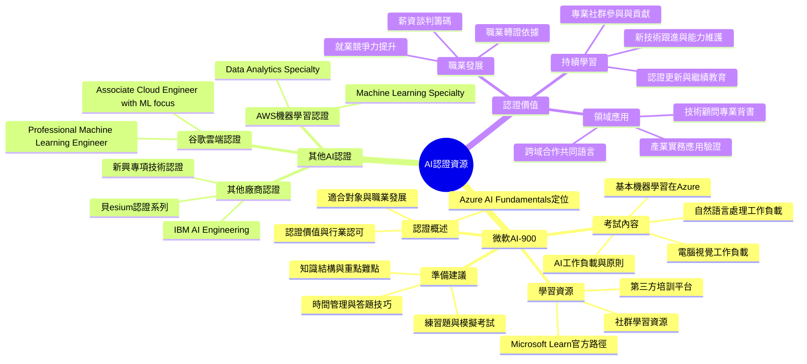

# AI 認證資源與學習指南

[[AI_system/AI認證.md]]

## 核心概念
本文件整理了AI領域的認證資源和學習指南，特別聚焦於微軟AI-900認證（Azure AI Fundamentals）以及其他相關的AI認證項目。內容包括官方考試資訊、第三方培訓資源和社群經驗分享。這些認證適合希望正式驗證AI基礎知識的學習者、職場專業人士和技術顧問，提供了職業發展的階梯式路徑和知識更新的持續框架。

## 人工智慧系統領域專章
### 模型拓撲架構
AI認證課程中涵蓋的模型拓撲知識包括：
- 人工智慧基礎：機器學習 vs 深度學習的區別與聯繫
- 常見AI工作負載：分類、回歸、聚類、推薦系統和電腦視覺任務
- 微軟Azure AI服務：認知服務、機器學習服務和知識探勘服務
- 模型生命週期：從資料準備、模型訓練到部署和監控的完整流程
- 責任任施AI：公平性、可解釋性、隱私保護和透明度要求

### 資料前處理與張量維度
認證課程中的資料處理知識包括：
- 資料類型理解：結構化、半結構化和非結構化資料的特徵
- 資料清理技術：缺失值處理、異常值檢測和資料標準化
- 特徵工程：特徵選擇、特徵萃取和特徵轉換基礎概念
- 資料儲存格式：關係資料庫、NoSQL資料庫和資料倉儲基礎知識
- 大資料處理：分散式計算框架和批次 vs 串流處理選項

### 前向傳播推理
認證課程中的AI應用基礎包括：
- 監督學習：分類和回歸算法的基本原理和應用場景
- 無監督學習：聚類和關聯規則學習的基礎概念
- 增強學習：馬爾可夫決策過程和獎勵機制的基礎介紹
- 神經網路基礎：感知器、激活函數和反向傳播算法
- 模型評估：適當的評估指標選擇和交叉驗證技術

### 吞吐量與硬體開銷最佳化
認證課程中的實務考量包括：
- 雲端計算基礎：IaaS、PaaS和SaaS服務模式區別
- 資源管理與成本優化：訂閱管理、資源標籤和使用監控
- 效能監控與調整：指標監視、自動彈性和效能基準測試
- 安全與合規：身份驗證、存取控制和資料保護措施
- 部署策略：藍綠部署、金絲雀發布和輪流更新策略

## Mermaid 心智圖


## C++ 實作範例（無 STL）
以下示範一個簡單的配置管理實作，用於儲存和讀取AI認證相關的設置，使用原始指標操作而非 STL 容器：

```cpp
#include <cuda_runtime.h>
#include <cstdlib>
#include <cstring>

// 簡單的鍵值對配置管理類
class SimpleConfig {
public:
    SimpleConfig() : capacity_(10), size_(0) {
        keys_ = (char**)malloc(capacity_ * sizeof(char*));
        values_ = (char**)malloc(capacity_ * sizeof(char*));
        for (int i = 0; i < capacity_; i++) {
            keys_[i] = nullptr;
            values_[i] = nullptr;
        }
    }
    
    ~SimpleConfig() {
        clear();
        free(keys_);
        free(values_);
    }
    
    // 設置鍵值對
    bool set(const char* key, const char* value) {
        // 首先檢查鍵是否已存在
        for (int i = 0; i < size_; i++) {
            if (strcmp(keys_[i], key) == 0) {
                // 更新現有值
                free(values_[i]);
                values_[i] = strdup(value);
                return true;
            }
        }
        
        // 鍵不存在，添加新條目
        if (size_ >= capacity_) {
            // 需要擴容
            capacity_ *= 2;
            keys_ = (char**)realloc(keys_, capacity_ * sizeof(char*));
            values_ = (char**)realloc(values_, capacity_ * sizeof(char*));
            for (int i = size_; i < capacity_; i++) {
                keys_[i] = nullptr;
                values_[i] = nullptr;
            }
        }
        
        // 添加新鍵值對
        keys_[size_] = strdup(key);
        values_[size_] = strdup(value);
        size_++;
        return true;
    }
    
    // 獲取值
    const char* get(const char* key) const {
        for (int i = 0; i < size_; i++) {
            if (strcmp(keys_[i], key) == 0) {
                return values_[i];
            }
        }
        return nullptr; // 鍵不存在
    }
    
    // 移除鍵值對
    bool remove(const char* key) {
        for (int i = 0; i < size_; i++) {
            if (strcmp(keys_[i], key) == 0) {
                // 釋放當前條目
                free(keys_[i]);
                free(values_[i]);
                
                // 移動後續條目填補空缺
                for (int j = i; j < size_ - 1; j++) {
                    keys_[j] = keys_[j + 1];
                    values_[j] = values_[j + 1];
                }
                
                size_--;
                return true;
            }
        }
        return false; // 鍵不存在
    }
    
    // 清空所有內容
    void clear() {
        for (int i = 0; i < size_; i++) {
            free(keys_[i]);
            free(values_[i]);
        }
        size_ = 0;
    }
    
private:
    char** keys_;
    char** values_;
    int capacity_;
    int size_;
};

// 使用範例：管理AI認證資訊
void manage_certification_info() {
    // 建立配置實例
    SimpleConfig config;
    
    // 添加認證資訊
    config.set("certification_name", "AI-900: Microsoft Azure AI Fundamentals");
    config.set("provider", "Microsoft");
    config.set("exam_code", "AI-900");
    config.set("validity_years", "2"); // 假設有效期為2年
    
    // 讀取認證資訊
    const char* cert_name = config.get("certification_name");
    const char* provider = config.get("provider");
    const char* exam_code = config.get("exam_code");
    
    // 使用認證資訊（這裡只是示範，實際應用中可能會發送請求或顯示資訊）
    if (cert_name && provider && exam_code) {
        // 例如：打印認證資訊
        // printf("Certification: %s\\nProvider: %s\\nExam Code: %s\\n", 
        //        cert_name, provider, exam_code);
    }
    
    // 更新認證資訊
    config.set("validity_years", "1"); // 更新有效期
    
    // 移除不再需要的資訊
    config.remove("exam_code"); // 假設我們不要再保存考試代碼
}
```

## Python 純標準庫範例
以下示範使用純 Python 實作簡單的認證資訊管理系統，僅使用標準庫而非第三方庫：

```python
import json
import os
from typing import Dict, Any, Optional, List
from datetime import datetime, timedelta

class CertificationManager:
    """AI認證資訊管理類"""
    
    def __init__(self, storage_file: Optional[str] = None):
        self.certifications: Dict[str, Dict[str, Any]] = {}
        self.storage_file = storage_file
        if storage_file:
            self.load_from_file()
    
    def add_certification(
        self,
        cert_id: str,
        name: str,
        provider: str,
        exam_code: Optional[str] = None,
        validity_years: int = 0,
        description: Optional[str] = None
    ) -> bool:
        """添加認證資訊"""
        if cert_id in self.certifications:
            return False  # 已存在
        
        cert_info = {
            "name": name,
            "provider": provider,
            "exam_code": exam_code,
            "validity_years": validity_years,
            "description": description,
            "issued_date": None,
            "expires_date": None
        }
        
        self.certifications[cert_id] = cert_info
        
        if self.storage_file:
            self.save_to_file()
        
        return True
    
    def get_certification(self, cert_id: str) -> Optional[Dict[str, Any]]:
        """獲取認證資訊"""
        return self.certifications.get(cert_id)
    
    def update_certification(
        self,
        cert_id: str,
        **kwargs
    ) -> bool:
        """更新認證資訊"""
        if cert_id not in self.certifications:
            return False
        
        for key, value in kwargs.items():
            if key in self.certifications[cert_id]:
                self.certifications[cert_id][key] = value
        
        if self.storage_file:
            self.save_to_file()
        
        return True
    
    def remove_certification(self, cert_id: str) -> bool:
        """移除認證資訊"""
        if cert_id not in self.certifications:
            return False
        
        del self.certifications[cert_id]
        
        if self.storage_file:
            self.save_to_file()
        
        return True
    
    def issue_certification(self, cert_id: str, issue_date: Optional[datetime] = None) -> bool:
        """發行認證"""
        if cert_id not in self.certifications:
            return False
        
        if issue_date is None:
            issue_date = datetime.now()
        
        self.certifications[cert_id]["issued_date"] = issue_date
        
        # 計算過期日期
        validity_years = self.certifications[cert_id].get("validity_years", 0)
        if validity_years > 0:
            expires_date = issue_date + timedelta(days=365 * validity_years)
            self.certifications[cert_id]["expires_date"] = expires_date
        
        if self.storage_file:
            self.save_to_file()
        
        return True
    
    def is_valid(self, cert_id: str, check_date: Optional[datetime] = None) -> bool:
        """檢查認證是否有效"""
        if cert_id not in self.certifications:
            return False
        
        cert_info = self.certifications[cert_id]
        issued_date = cert_info.get("issued_date")
        expires_date = cert_info.get("expires_date")
        
        if issued_date is None:
            return False  # 未發行的認證不視為有效
        
        if check_date is None:
            check_date = datetime.now()
        
        # 检查是否已發行且未过期
        if check_date < issued_date:
            return False
        
        if expires_date is not None and check_date > expires_date:
            return False
        
        return True
    
    def list_certifications(self) -> List[Dict[str, Any]]:
        """列出所有認證"""
        result = []
        for cert_id, cert_info in self.certifications.items():
            info = cert_info.copy()
            info["cert_id"] = cert_id
            result.append(info)
        return result
    
    def save_to_file(self) -> bool:
        """將認證資訊保存到文件"""
        if not self.storage_file:
            return False
        
        try:
            # 確保目錄存在
            directory = os.path.dirname(self.storage_file)
            if directory and not os.path.exists(directory):
                os.makedirs(directory)
            
            # 轉換日期對象為ISO格式字符串以便JSON序列化
            data_to_save = {}
            for cert_id, cert_info in self.certifications.items():
                info_copy = cert_info.copy()
                for date_field in ["issued_date", "expires_date"]:
                    date_val = info_copy.get(date_field)
                    if date_val is not None:
                        info_copy[date_field] = date_val.isoformat()
                data_to_save[cert_id] = info_copy
            
            with open(self.storage_file, 'w', encoding='utf-8') as f:
                json.dump(data_to_save, f, indent=2, ensure_ascii=False)
            return True
        except Exception as e:
            print(f"保存認證資訊失敗: {e}")
            return False
    
    def load_from_file(self) -> bool:
        """從文件載入認證資訊"""
        if not self.storage_file or not os.path.exists(self.storage_file):
            return False
        
        try:
            with open(self.storage_file, 'r', encoding='utf-8') as f:
                data_loaded = json.load(f)
            
            # 轉換ISO格式字符串回日期對象
            for cert_id, cert_info in data_loaded.items():
                for date_field in ["issued_date", "expires_date"]:
                    date_str = cert_info.get(date_field)
                    if date_str is not None:
                        cert_info[date_field] = datetime.fromisoformat(date_str)
            
            self.certifications = data_loaded
            return True
        except Exception as e:
            print(f"載入認證資訊失敗: {e}")
            return False

# 使用範例
if __name__ == "__main__":
    # 建立認證管理器實例
    cert_manager = CertificationManager("ai_certifications.json")
    
    # 添加AI-900認證資訊
    cert_manager.add_certification(
        cert_id="ai-900",
        name="AI-900: Microsoft Azure AI Fundamentals",
        provider="Microsoft",
        exam_code="AI-900",
        validity_years=2,
        description="驗證Azure AI服務和機器學習基礎知識的入門級認證"
    )
    
    # 添加另一個認證示例
    cert_manager.add_certification(
        cert_id="aws-ml-specialty",
        name="AWS Certified Machine Learning Specialty",
        provider="AWS",
        exam_code="MLS-C01",
        validity_years=3,
        description="驗證在AWS平台上構建、訓練和部署機器學習模型的能力"
    )
    
    # 発行AI-900認證
    cert_manager.issue_certification("ai-900")
    
    # 檢查認證是否有效
    is_valid = cert_manager.is_valid("ai-900")
    print(f"AI-900認證是否有效: {is_valid}")
    
    # 列出所有認證
    certifications = cert_manager.list_certifications()
    print(f"\n認證總數: {len(certifications)}")
    for cert in certifications:
        print(f"- {cert['name']} ({cert['provider']})")
        if cert.get("issued_date"):
            print(f"  發行日期: {cert['issued_date'].strftime('%Y-%m-%d')}")
        if cert.get("expires_date"):
            print(f"  過期日期: {cert['expires_date'].strftime('%Y-%m-%d')}")
    
    # 保存認證資訊
    cert_manager.save_to_file()
```

## 參考資料
[[AI_system/AI認證.md]]

1. https://www.tqcplus.org.tw/CertificateDetail.aspx?CODE=XgSlxg3TL8Q=
2. http://ipoetech.com/AIL
3. ### mircosoft AI-900
4. https://sdwh.dev/posts/2021/04/Azure-Certificate-AI-100/
5. http://blog.fens.me/certificate-ai900/
6. https://learn.microsoft.com/zh-tw/certifications/exams/ai-900/

## 相關筆記
- [[AI_system/ai-education]]
- [[AI_system/microsoft-azure]]
- [[AI_system/cloud-certifications]]
- [[AI_system/professional-development]]