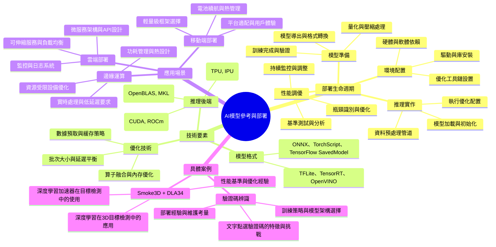

# AI 模型參考資料與部署指南

[[AI_system/AI_model_Reference web.md]]

## 核心概念
本文件整理了AI模型的參考資料和部署指南，特別聚焦於C++和計算機視覺（CV）領域的模型推理部署。內容包括Smoke3D中DLA34的詳細解析以及訓練文字點選驗證碼辨識模型的實作經驗。這些資料對於希望將訓練好的AI模型部署到生產環境、特別是邊緣設備或實時系統中的開發者具有重要參考價值。

## 人工智慧系統領域專章
### 模型拓撲架構
在AI模型部署過程中，理解模型拓撲架構至關重要：
- 模型壓縮技術：權重量化、結構化/非結構化裁剪、知識蒸餾等方法減少模型大小和計算量
- 推理優化：算子融合、內存布局優化、計算圖重構等技術提升推理效率
- 硬體適配：針對不同硬體平台（CPU、GPU、ASIC、FPGA）進行模型優化和適配
- 邊緣部署考量：受限計算資源、功耗約束和實時性要求下的模型設計策略

### 資料前處理與張量維度
部署前的資料準備張量處理包括：
- 輸入標準化：確保部署時的資料預處理與訓練時保持一致
- 批次處理：靜態批次 vs 動態批次，根據應用場景選擇適當策略
- 內存對齊：針對特定硬體架構優化內存訪問模式
- 資料格式轉換：在不同框架和平台間進行張量格式轉換 (NCHW↔NHWC)

### 前向傳播推理
推理階段的關鍵技術考量：
- 內存管理：緩衝區分配、重用和釋放策略避免內存洩漏
- 計算效率：利用硬體加速單元（Tensor CUDA核心、專用指令）提升運算速度
- 延遲優化：流水線處理、異步執行和預取技術減少推理延遲
- 數值穩定性：在量化過程中保持數值精度和防止誤差累積

### 吞吐量與硬體開銷最佳化
提高部署系統性能的策略：
- 批次大小優化：根據延遲要求和吞吐量需求動態調整批次大小
- 併發處理：多線程、異步IO和批次處理提升系統總體吞吐量
- 硬體加速：利用GPU、FPGA或專用AI加速卡進行計算卸載
- 優化編譯：使用針對特定硬體優化的編譯器選項和編譯流程
- 資源監控：實時監控計算資源使用情況並進行動態調整

## Mermaid 心智圖


## C++ 實作範例（無 STL）
以下示範一個簡單的模型推理框架中的張量內存管理實作，使用原始指標操作而非 STL 容器：

```cpp
#include <cuda_runtime.h>
#include <cstdlib>

// 簡單的張量內存管理類
class Tensor {
public:
    Tensor() : data_(nullptr), size_(0) {}
    
    explicit Tensor(size_t size) {
        resize(size);
    }
    
    ~Tensor() {
        free();
    }
    
    void resize(size_t size) {
        free();
        if (size > 0) {
            cudaMalloc(&data_, size * sizeof(float));
            size_ = size;
        }
    }
    
    void free() {
        if (data_ !== nullptr) {
            cudaFree(data_);
            data_ = nullptr;
            size_ = 0;
        }
    }
    
    float* data() { return data_; }
    const float* data() const { return data_; }
    size_t size() const { return size_; }
    
    // 從主機端複製資料到設備端
    void copy_from_host(const float* host_data, size_t count) {
        size_t copy_count = (count < size_) ? count : size_;
        cudaMemcpy(data_, host_data, copy_count * sizeof(float), cudaMemcpyHostToDevice);
    }
    
    // 從設備端複製資料到主機端
    void copy_to_host(float* host_data, size_t count) const {
        size_t copy_count = (count < size_) ? count : size_;
        cudaMemcpy(host_data, data_, copy_count * sizeof(float), cudaMemcpyDeviceToHost);
    }
    
private:
    float* data_;
    size_t size_;
};

// 模型推理上下文管理類
class InferenceContext {
public:
    InferenceContext() : input_tensor_(nullptr), output_tensor_(nullptr) {}
    
    ~InferenceContext() {
        cleanup();
    }
    
    // 初始化推理上下文
    bool initialize(size_t input_size, size_t output_size) {
        cleanup();
        
        input_tensor_ = new Tensor(input_size);
        output_tensor_ = new Tensor(output_size);
        
        return (input_tensor_ && output_tensor_ &&
                input_tensor_->size() == input_size &&
                output_tensor_->size() == output_size);
    }
    
    // 釋放資源
    void cleanup() {
        delete input_tensor_;
        delete output_tensor_;
        input_tensor_ = nullptr;
        output_tensor_ = nullptr;
    }
    
    // 設定輸入資料
    void set_input(const float* data, size_t size) {
        if (input_tensor_) {
            input_tensor_->copy_from_host(data, size);
        }
    }
    
    // 獲取輸出資料
    void get_output(float* data, size_t size) {
        if (output_tensor_) {
            output_tensor_->copy_to_host(data, size);
        }
    }
    
private:
    Tensor* input_tensor_;
    Tensor* output_tensor_;
};

// 使用範例
void run_inference_example() {
    // 建立推理上下文
    InferenceContext ctx;
    
    // 假設模型輸入為1x3x224x224 (圖像)，輸出為1000個類別
    const size_t input_size = 1 * 3 * 224 * 224;
    const size_t output_size = 1000;
    
    if (!ctx.initialize(input_size, output_size)) {
        // 處理初始化失敗
        return;
    }
    
    // 準備輸入資料（此處應該是真實的圖像資料）
    float input_data[input_size];
    // ... 填充輸入資料 ...
    
    // 設定輸入
    ctx.set_input(input_data, input_size);
    
    // 執行模型推理（此處應該調用實際的模型推理函數）
    // model_inference(ctx.input_tensor_->data(), ctx.output_tensor_->data());
    
    // 獲取輸出
    float output_data[output_size];
    ctx.get_output(output_data, output_size);
    
    // 處理推理結果
    // ... 處理output_data ...
    
    // 上下文會在離開作用域時自動清理資源
}
```

## Python 純標準庫範例
以下示範使用純 Python 實作簡單的配置管理系統，僅使用標準庫而非第三方庫：

```python
import json
import os
from typing import Dict, Any, Optional
from pathlib import Path

class ModelConfig:
    """AI模型配置管理類"""
    
    def __init__(self, config_path: Optional[str] = None):
        self.config_data: Dict[str, Any] = {}
        if config_path:
            self.load(config_path)
    
    def load(self, config_path: str) -> bool:
        """從JSON文件載入配置"""
        try:
            with open(config_path, 'r', encoding='utf-8') as f:
                self.config_data = json.load(f)
            return True
        except (FileNotFoundError, json.JSONDecodeError) as e:
            print(f"載入配置失敗: {e}")
            return False
    
    def save(self, config_path: str) -> bool:
        """將配置保存到JSON文件"""
        try:
            # 確保目錄存在
            directory = os.path.dirname(config_path)
            if directory and not os.path.exists(directory):
                os.makedirs(directory)
            
            with open(config_path, 'w', encoding='utf-8') as f:
                json.dump(self.config_data, f, indent=2, ensure_ascii=False)
            return True
        except Exception as e:
            print(f"保存配置失敗: {e}")
            return False
    
    def get(self, key: str, default: Any = None) -> Any:
        """獲取配置值"""
        return self.config_data.get(key, default)
    
    def set(self, key: str, value: Any) -> None:
        """設置配置值"""
        self.config_data[key] = value
    
    def has(self, key: str) -> bool:
        """檢查是否存在指定鍵"""
        return key in self.config_data
    
    def remove(self, key: str) -> bool:
        """移除指定鍵"""
        if key in self.config_data:
            del self.config_data[key]
            return True
        return False
    
    def to_dict(self) -> Dict[str, Any]:
        """返回配置字典的副本"""
        return self.config_data.copy()
    
    def update(self, other: Dict[str, Any]) -> None:
        """用另一個字典更新配置"""
        self.config_data.update(other)

# 使用範例
if __name__ == "__main__":
    # 創建模型配置實例
    config = ModelConfig()
    
    # 設置一些基本配置
    config.set("model_name", "resnet50")
    config.set("input_size", [224, 224, 3])
    config.set("batch_size", 32)
    config.set("precision", "FP16")
    config.set("use_gpu", True)
    
    # 添加嵌套配置
    optimization_config = {
        "enable_fp16": True,
        "max_batch_size": 64,
        "workspace_size_mb": 1024
    }
    config.set("tensorrt", optimization_config)
    
    # 保存配置到文件
    config.save("model_config.json")
    
    # 從文件載入配置
    loaded_config = ModelConfig("model_config.json")
    
    # 讀取配置值
    model_name = loaded_config.get("model_name", "unknown")
    batch_size = loaded_config.get("batch_size", 1)
    use_gpu = loaded_config.get("use_gpu", False)
    
    print(f"模型名稱: {model_name}")
    print(f"批次大小: {batch_size}")
    print(f"使用GPU: {use_gpu}")
    
    # 檢查特定配置是否存在
    if loaded_config.has("tensorrt"):
        trtc_config = loaded_config.get("tensorrt", {})
        print(f"TensorRT工作區大小: {trtc_config.get('workspace_size_mb', 0)} MB")
```

## 參考資料
[[AI_system/AI_model_Reference web.md]]

1. [C++/CV/推理部署資料整理](https://zhuanlan.zhihu.com/p/414317269)
2. [Smoke3D中DLA34與輸出詳解](https://blog.csdn.net/kalahali/article/details/132363045)
3. [訓練一個文字點選驗證碼辨識模型](https://blog.csdn.net/kalahali/article/details/131529828)

## 相關筆記
- [[AI_system/model-deployment]]
- [[AI_system/inference-optimization]]
- [[AI_system/edge-ai]]
- [[AI_system/model-compression]]