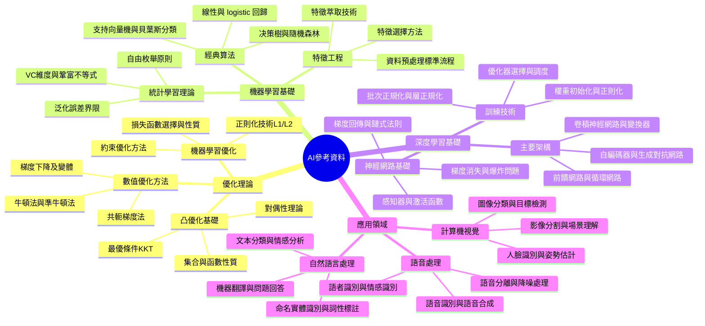

# AI 參考資料與學習筆記

[[AI_system/AI_reference.md]]

## 核心概念
本文件整理了AI領域的參考資料和學習筆記，特別聚焦於優化理論、機器學習和深度學習的基礎知識。內容包括來自CSDN博客專欄的分類連結，涵蓋優化理論學習、機器學習與深度學習筆記以及機器學習基礎概念。這些資料適合希望建堅實AI理論基礎的學習者和實踐者，提供了從基礎概念到進階主題的結構化學習路徑。

## 人工智慧系統領域專章
### 模型拓撲架構
AI理論基礎中的模型拓撲架構知識包括：
- 機器學習模型：線性回歸、決策樹、支持向量機、貝葉斯分類器等經典模型的數學基礎
- 深度學習架構：前饋神經網路、卷積神經網路、循環神經網路和變換器等現代架構的結構特點
- 優化理論：凸優化、拉格朗日乘子法、KKT條件等數學優化方法在機器學習中的應用
- 模型表達能力：VC維度、 russischen 數和覆蓋數等理論工具衡量模型複雜度
- 一般化誤差分析：偏差-方差分解、不等式界限和學習理論基礎

### 資料前處理與張量維度
資料準備和特徵工程的基礎知識包括：
- 特徵縮放：標準化、正規化和極值縮放等方法確保特徵在相近範圍內
- 特徵編碼 : 一熱編碼、序數編碼和二進制編碼處理類別特徵
- 特徵選擇：過濾法、包裹法和嵌入法選擇最相關特徵子集
- 降維技術：主成分分析(PCA)、線性判別分析(LDA)和t-SNE等方法降低特徵維度
- 資料增強：通過變換生成新訓練樣本提高模型泛化能力

### 前向傳播推理
機器學習模型的預測過程包括：
- 線性模型：權重參數與特徵的點積加上偏置項
- 距離度量模型：基於實例間距離的相似度計算和投票機制
- 基於樹的模型：特徵判斷決策路徑和葉節點預測值統計
- 神經網路：層間加權求和和激活函數的複雜非線性變換
- 集成學習：多個弱學習者通過投票或加權平均構成強學習者

### 吞吐量與硬體開銷最佳化
理論知識在實際系統中的應用包括：
- 計算複雜度分析：時間複雜度和空間複雜度評估演算法效率
- 記憶體訪問模式：區域性原理和Cache友善資料結構設計
- 並行計算原則：Amdahl定義和Gustafson定律指導並行優化策略
- 數值穩定性：避免數值計算中的災難性消失和保持計算精度
- 實際部署考量：模型大小、推理延遲和能源消耗的平衡優化

## Mermaid 心智圖


## C++ 實作範例（無 STL）
以下示範一個簡單的線性回歸模型實作，使用原始指標操作而非 STL 容器：

```cpp
#include <cuda_runtime.h>
#include <cmath>
#include <cstdlib>

// 線性回歸預測核函數
__global__ def predict_kernel(
    const float* X,      // 特徵矩陣 [n_samples * n_features]
    const float* weights, // 權重向量 [n_features]
    float* predictions,   // 預測結果 [n_samples]
    float bias,           // 偏置項
    int n_samples,
    int n_features
) {
    int idx = blockIdx.x * blockDim.x + threadIdx.x;
    if (idx >= n_samples) return;
    
    // 計算單個樣本的預測值
    float sum = bias;
    for (int i = 0; i < n_features; i++) {
        int feature_idx = idx * n_features + i;
        sum += X[feature_idx] * weights[i];
    }
    predictions[idx] = sum;
}

// 主機端啟動函式
void launch_linear_regression_predict(
    const float* d_X,
    const float* d_weights,
    float* d_predictions,
    float bias,
    int n_samples,
    int n_features
) {
    int blockSize = 256;
    int gridSize = (n_samples + blockSize - 1) / blockSize;
    
    predict_kernel<<<gridSize, blockSize>>>(d_X, d_weights, d_predictions, bias, n_samples, n_features);
    cudaDeviceSynchronize();
}

// 均方誤差損失函數
__global__ void mse_loss_kernel(
    const float* predictions, // 預測值 [n_samples]
    const float* targets,     // 真實值 [n_samples]
    float* loss,              // 損失值 [1]
    int n_samples
) {
    int idx = blockIdx.x * blockDim.x + threadIdx.x;
    if (idx >= n_samples) return;
    
    float error = predictions[idx] - targets[idx];
    float squared_error = error * error;
    
    // 使用原子加法進行全域归约
    atomicAdd(loss, squared_error);
}

float calculate_mse_loss(
    const float* d_predictions,
    const float* d_targets,
    int n_samples
) {
    float* d_loss;
    cudaMalloc(&d_loss, sizeof(float));
    cudaMemset(d_loss, 0, sizeof(float));
    
    int blockSize = 256;
    int gridSize = (n_samples + blockSize - 1) / blockSize;
    
    mse_loss_kernel<<<gridSize, blockSize>>>(d_predictions, d_targets, d_loss, n_samples);
    cudaDeviceSynchronize();
    
    float h_loss;
    cudaMemcpy(&h_loss, d_loss, sizeof(float), cudaMemcpyDeviceToHost);
    
    cudaFree(d_loss);
    
    return h_loss / n_samples; // 平均得到MSE
}
```

## Python 純標準庫範例
以下示範使用純 Python 實作簡單的梯度下降優化器，僅使用標準庫而非 NumPy：

```python
from typing import List, Tuple, Callable
import math
import random

def gradient_descent(
    objective_func: Callable[[List[float]], Tuple[float, List[float]]],
    initial_params: List[float],
    learning_rate: float = 0.01,
    max_iterations: int = 1000,
    tolerance: float = 1e-6
) -> Tuple[List[float], List[float]]:
    """
    簡單的梯度下降優化器實作
    
    參數:
        objective_func: 目標函數，輸入參數向量，返回(損失值, 梯度向量)
        initial_params: 初始參數向量
        learning_rate: 學習率
        max_iterations: 最大迭代次數
        tolerance: 收斂容忍度
    
    返回:
        (最優參數向量, 損失歷史列表)
    """
    params = initial_params.copy()
    loss_history = []
    
    for i in range(max_iterations):
        # 計算當前參數的損失和梯度
        loss, gradient = objective_func(params)
        loss_history.append(loss)
        
        # 檢查收斂條件
        if loss < tolerance:
            break
        
        # 更新參數
        for j in range(len(params)):
            params[j] -= learning_rate * gradient[j]
        
        # 可選：打印進度信息
        if i % 100 == 0:
            print(f"迭代 {i}: 損失 = {loss:.6f}")
    
    return params, loss_history

# 範例目標函數：二次函數 f(x) = x^2 + 2x + 1
def quadratic_objective(params: List[float]) -> Tuple[float, List[float]]:
    """
    二次函數目標：f(x) = x^2 + 2x + 1
    最優解：x = -1，f(-1) = 0
    """
    x = params[0]
    loss = x * x + 2 * x + 1
    gradient = [2 * x + 2]  # df/dx = 2x + 2
    return loss, gradient

# 使用範例
if __name__ == "__main__":
    # 從隨機初始點開始優化
    initial_params = [random.uniform(-5, 5)]  # 隨機初始值在[-5, 5]範圍
    
    print(f"初始參數: {initial_params[0]:.4f}")
    
    # 執行梯度下降優化
    optimal_params, loss_history = gradient_descent(
        objective_func=quadratic_objective,
        initial_params=initial_params,
        learning_rate=0.1,
        max_iterations=100,
        tolerance=1e-6
    )
    
    print(f"最優參數: {optimal_params[0]:.6f}")
    print(f"最優損失: {loss_history[-1]:.6f}")
    print(f"迭代次數: {len(loss_history)}")
    
    # 顯示收斂過程（最後幾次迭代）
    print("\n最後5次迭代的損失:")
    for i in range(max(0, len(loss_history)-5), len(loss_history)):
        print(f"  迭代 {i}: 損失 = {loss_history[i]:.6f}")
```

## 參考資料
[[AI_system/AI_reference.md]]

1. [優化理論學習](https://blog.csdn.net/xbinworld/category_9708808.html)
2. [機器學習與深度學習筆記](https://blog.csdn.net/xbinworld/category_9268229.html)
3. [機器學習Machine Learning](https://blog.csdn.net/xbinworld/category_878118.html)

## 相關筆記
- [[AI_system/optimization-theory]]
- [[AI_system/machine-learning-basics]]
- [[AI_system/deep-learning-fundamentals]]
- [[AI_system/ai-mathematics]]