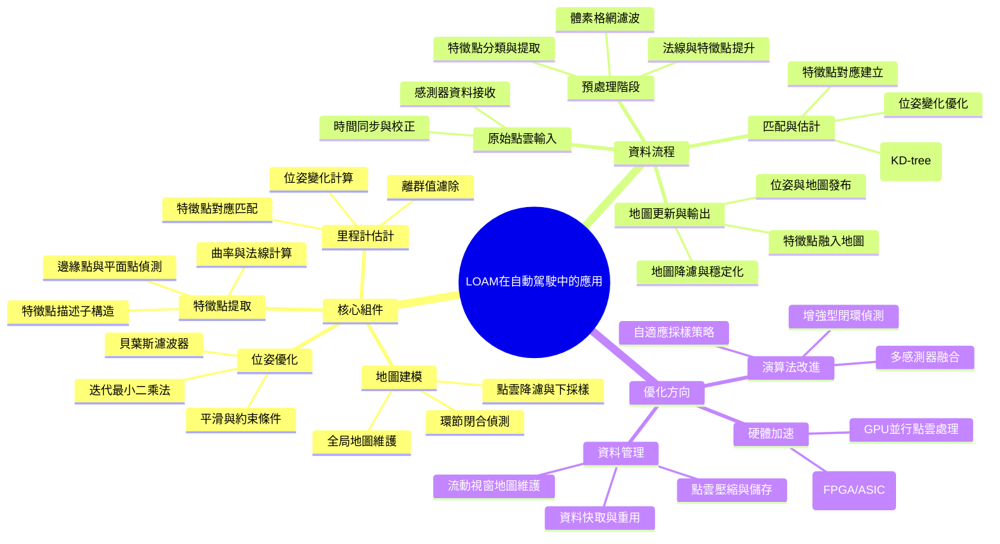

# 李達光學測距與繪製演算法 (LOAM) 在自動駕駛中的應用

[[AI_system/自動駕駛.md]]

## 核心概念
本文件整理了兩篇關於自動駕駛領域中LeGO-LOAM和A-LOAM演算法的學習筆記，詳細解析了這兩種Lidar Odometry and Mapping (LOAM)變體的原始碼實作與理論基礎。LOAM系列演算法是基於李達光點雲的里程計估計和同時定位與地圖繪製（SLAM）技術，在自動駕駛環境中提供高精度的車輛定位和周圍環境建模。

## 人工智慧系統領域專章
### 模型拓撲架構
LOAM架構主要由以下模組組成：
- 特徵點提取：從李達光點雲中提取邊緣點和平面點等幾何特徵
- 里程計估計：透過特徵點間的對應关系計算車輛位姿變化
- 地圖建模：將當前幀的特徵點加入全局地圖並進行降維處理
- 位姿優化：使用迭代最小二乘法或貝葉斯濾波器優化里程計估計
- 環節閉合偵測：透過回圈閉合偵測減少累積誤差

### 資料前處理與張量維度
李達光點雲資料的預處理步驟包括：
- 點雲採樣：透過體素格網濾波降低點雲密度加快處理速度
- 法線估計：計算每個點的表面法線以增強特徵描述能力
- 特徵描述子：構建如FPFH或PFH等特徵向量用於點對點匹配
- 資料組織：使用KD-tree或八叉樹等空間索引結構加速最近鄰搜尋
- 座標轉換：將點雲從感測器座標系轉換到車輛或世界座標系

### 前向傳播推理
LOAM的實時處理流程如下：
1. 原始點雲輸入：接收李達光感測器發布的點雲訊息
2. 預處理階段：執行點雲採樣、法線計算和特徵點提取
3. 特徵點匹配：將當前幀特徵點與地圖或前幀特徵點進行最近鄰搜尋
4. 位姿估計：透過特徵點對應关系計算相對位姿變化
5. 地圖更新：將新特徵點融入全局地圖並執行地圖降維
6. 輸出結果：發布經過優化的車輛位姿和局部地圖資訊

### 吞吐量與硬體開銷最佳化
提高LOAM系統效率的策略包括：
- 計算優化：使用SSE/AVX向量化指令加速點雲運算
- 記憶體管理：事先分配點雲緩衝區避免運行時動態分配
- 並行處理：利用多核心CPU或GPU進行特徵點提取和匹配的平行運算
- 資料下採樣：動態調整點雲密度平衡精度與效率
- 演算法簡化：在特定場景下使用輕量級特徵點描述子減少計算量

## Mermaid 心智圖


## C++ 實作範例（無 STL）
以下示範一個簡單的點雲讀取和基本處理實作，使用原始指標操作而非 STL 容器（這是 LOAM 系統中點雲處理的基礎部分）：

```cpp
#include <cstdio>
#include <cstdlib>
#include <cmath>
#include <cstring>

// 點雲結構體定義
struct Point {
    float x, y, z;  // 座標
    float intensity; // 反射強度 (可選)
};

// 簡單的點雲緩衝區管理類
class PointCloudBuffer {
public:
    PointCloud() : points_(nullptr), size_(0), capacity_(0) {}
    
    ~PointCloudBuffer() {
        free(points_);
    }
    
    // 動態擴容緩衝區
    bool reserve(size_t new_capacity) {
        if (new_capacity <= capacity_) return true;
        
        Point* new_points = (Point*)realloc(points_, new_capacity * sizeof(Point));
        if (!new_points) return false;
        
        points_ = new_points;
        capacity_ = new_capacity;
        return true;
    }
    
    // 添加點到緩衝區
    bool push_back(const Point& p) {
        if (size_ >= capacity_) {
            if (!reserve(capacity_ == 0 ? 1 : capacity_ * 2)) {
                return false;
            }
        }
        points_[size_] = p;
        size_++;
        return true;
    }
    
    // 獲取點雲數據
    Point* data() { return points_; }
    const Point* data() const { return points_; }
    size_t size() const { return size_; }
    size_t capacity() const { return capacity_; }
    
    // 清空緩衝區
    void clear() { size_ = 0; }
    
private:
    Point* points_;
    size_t size_;
    size_t capacity_;
};

// 讀取PCD點雲檔案（簡化版本，僅支援ASCII格式）
bool loadPCDFile(const char* filename, PointCloudBuffer& cloud) {
    FILE* file = fopen(filename, "r");
    if (!file) return false;
    
    // 跳過標頭（簡化處理）
    char line[256];
    while (fgets(line, sizeof(line), file)) {
        if (strncmp(line, "DATA", 4) == 0) break;
    }
    
    // 讀取點雲數據
    Point p;
    while (fscanf(file, "%f %f %f %f\n", &p.x, &p.y, &p.z, &p.intensity) == 4) {
        if (!cloud.push_back(p)) {
            fclose(file);
            return false;
        }
    }
    
    fclose(file);
    return true;
}

// 體素格網濾波（下採樣）
void voxelGridFilter(const PointCloudBuffer& input, PointCloudBuffer& output, float leaf_size) {
    // 簡化實作：使用雜湊格網進行體素濾波
    // 實際應用應該使用更有效的空間雜湊或排序方法
    
    // 計算點雲邊界
    float min_x = 0, min_y = 0, min_z = 0;
    float max_x = 0, max_y = 0, max_z = 0;
    bool first = true;
    
    for (size_t i = 0; i < input.size(); i++) {
        const Point& p = input.data()[i];
        if (first) {
            min_x = max_x = p.x;
            min_y = max_y = p.y;
            min_z = max_z = p.z;
            first = false;
        } else {
            if (p.x < min_x) min_x = p.x;
            if (p.x > max_x) max_x = p.x;
            if (p.y < min_y) min_y = p.y;
            if (p.y > max_y) max_y = p.y;
            if (p.z < min_z) min_z = p.z;
            if (p.z > max_z) max_z = p.z;
        }
    }
    
    // 計算體素格網維度
    int div_x = (int)ceilf((max_x - min_x) / leaf_size);
    int div_y = (int)ceilf((max_y - min_y) / leaf_size);
    int div_z = (int)ceilf((max_z - min_z) / leaf_size);
    
    // 建立簡單的雜湊表（實際應該使用更好的資料結構）
    // 這裡僅示範概念，實際效率不高
    for (size_t i = 0; i < input.size(); i++) {
        const Point& p = input.data()[i];
        int ix = (int)floorf((p.x - min_x) / leaf_size);
        int iy = (int)floorf((p.y - min_y) / leaf_size);
        int iz = (int)floorf((p.z - min_z) / leaf_size);
        
        // 簡化處理：僅保留第一個落入每個體素的點
        // 實際應該計算體素中心或平均值
        // 為簡化起見，我們只添加第一個遇到的點
        bool found = false;
        for (size_t j = 0; j < output.size(); j++) {
            const Point& op = output.data()[j];
            int ojx = (int)floorf((op.x - min_x) / leaf_size);
            intojy = (int)floorf((op.y - min_y) / leaf_size);
            int ojz = (int)floorf((op.z - min_z) / leaf_size);
            if (ojx == ix && ojy == iy && ojz == iz) {
                found = true;
                break;
            }
        }
        if (!found) {
            output.push_back(p);
        }
    }
}

// 使用範例
void processPointCloudExample() {
    // 建立點雲緩衝區
    PointCloudBuffer cloud;
    
    // 讀取點雲檔案（假設存在 test.pcd）
    if (!loadPCDFile("test.pcd", cloud)) {
        // 處理錯誤
        return;
    }
    
    // 應用體素格網濾波進行下採樣
    PointCloudBuffer filtered_cloud;
    voxelGridFilter(cloud, filtered_cloud, 0.1f); // 10cm 體素大小
    
    // 處理濾波後的點雲（例如提取特徵點、計算里程計等）
    // ... 省略後續處理 ...
    
    // 緩衝區會在離開作用域時自動釋放記憶體
}
```

## Python 純標準庫範例
以下示範使用純 Python 實作簡單的點雲讀取和體素格網濾波，僅使用標準庫而非 NumPy 或第三方庫：

```python
from typing import List, Tuple
import math
import struct

class Point:
    """點雲點類別"""
    def __init__(self, x: float, y: float, z: float, intensity: float = 0.0):
        self.x = x
        self.y = y
        self.z = z
        self.intensity = intensity
    
    def __repr__(self) -> str:
        return f"Point({self.x:.3f}, {self.y:.3f}, {self.z:.3f}, {self.intensity:.3f})"

class PointCloud:
    """簡單的點雲類別"""
    def __init__(self):
        self.points: List[Point] = []
    
    def add_point(self, point: Point) -> None:
        self.points.append(point)
    
    def size(self) -> int:
        return len(self.points)
    
    def clear(self) -> None:
        self.points.clear()
    
    def load_pcd(self, filename: str) -> bool:
        """讀取PCD點雲檔案（簡化版本，僅支援ASCII格式）"""
        try:
            with open(filename, 'r') as f:
                # 跳過標頭
                for line in f:
                    if line.startswith('DATA'):
                        break
                # 讀取點雲數據
                for line in f:
                    parts = line.strip().split()
                    if len(parts) >= 4:
                        try:
                            x, y, z, intensity = map(float, parts[:4])
                            self.add_point(Point(x, y, z, intensity))
                        except ValueError:
                            # 跳過無效行
                            continue
            return True
        except Exception as e:
            print(f"讀取PCD檔案失敗: {e}")
            return False
    
    def voxel_grid_filter(self, leaf_size: float) -> 'PointCloud':
        """體素格網濾波（下採樣）"""
        if not self.points:
            return PointCloud()
        
        # 計算點雲邊界
        min_x = min_y = min_z = float('inf')
        max_x = max_y = max_z = float('-inf')
        
        for p in self.points:
            if p.x < min_x: min_x = p.x
            if p.x > max_x: max_x = p.x
            if p.y < min_y: min_y = p.y
            if p.y > max_y: max_y = p.y
            if p.z < min_z: min_z = p.z
            if p.z > max_z: max_z = p.z
        
        # 計算體素格網維度
        div_x = int(math.ceil((max_x - min_x) / leaf_size))
        div_y = int(math.ceil((max_y - min_y) / leaf_size))
        div_z = int(math.ceil((max_z - min_z) / leaf_size))
        
        # 建立體素標記雜湊集合
        voxel_set = set()
        filtered_cloud = PointCloud()
        
        for p in self.points:
            # 計算體素索引
            ix = int(math.floor((p.x - min_x) / leaf_size))
            iy = int(math.floor((p.y - min_y) / leaf_size))
            iz = int(math.floor((p.z - min_z) / leaf_size))
            voxel_key = (ix, iy, iz)
            
            # 如果該體素尚未被佔據，則添加該點並標記體素為已佔據
            if voxel_key not in voxel_set:
                voxel_set.add(voxel_key)
                filtered_cloud.add_point(Point(p.x, p.y, p.z, p.intensity))
        
        return filtered_cloud

# 使用範例
if __name__ == "__main__":
    # 建立點雲物件
    cloud = PointCloud()
    
    # 讀取點雲檔案（假設存在 test.pcd）
    if cloud.load_pcd("test.pcd"):
        print(f"原始點雲點數: {cloud.size()}")
        
        # 應用體素格網濾波進行下採樣
        filtered_cloud = cloud.voxel_grid_filter(0.1f)  # 10cm 體素大小
        print(f"濾波後點雲點數: {filtered_cloud.size()}")
        
        # 顯示前5個點作為檢查
        print("前5個點:")
        for i in range(min(5, len(filtered_cloud.points))):
            print(f"  {filtered_cloud.points[i]}")
    else:
        print("無法讀取點雲檔案")
```

## 參考資料
[[AI_system/自動駕駛.md]]

1. [無人駕駛學習筆記-LeGO-LOAM 演算法原始碼學習總結](https://ppipp.blog.csdn.net/article/details/125128247)
2. [無人駕駛學習筆記 - A-LOAM 演算法程式碼解析總結](https://ppipp.blog.csdn.net/article/details/125039397)

## 相關筆記
- [[AI_system/slam]]
- [[AI_system/lidar-processing]]
- [[AI_system/autonomous-vehicles]]
- [[AI_system/point-cloud-library]]