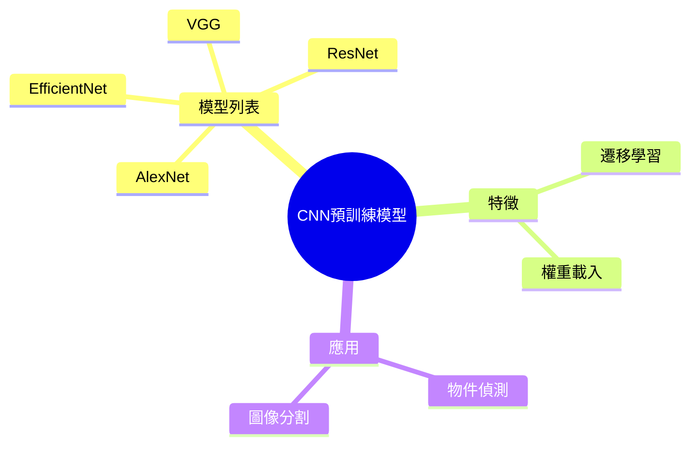

---
title: ""
source: "https://kilong31442.medium.com/%E5%A5%BD%E7%94%A8%E7%9A%84%E6%B7%B1%E5%BA%A6%E5%AD%B8%E7%BF%92cnn%E9%A0%90%E8%A8%93%E7%B7B4%E6%A8%A1%E5%9E%8B%E6%A1%86%E6%9E%B6%E7%B8%BD%E6%95%B4%E7%90%86-%E5%BE%9Ealexnet%E5%88%B0efficientnet-ml-%E9%9A%A8%E7%AD%86-f2ccb7a65621"
author: ""
published: ""
created: 2025-07-28
description: ""
tags:
  - AI_system
  - model_architecture
process: true
note-link: "[[AI_system/好用的深度學習CNN預訓練模型框架總整理: 從AlexNet到EfficientNet(ML 隨筆).md]]"
status: draft
aliases: []
related: []

## Mermaid 心智圖

[好用的深度學習CNN預訓練模型框架總整理: 從AlexNet到EfficientNet(ML 隨筆)](https://kilong31442.medium.com/%E5%A5%BD%E7%94%A8%E7%9A%84%E6%B7%B1%E5%BA%A6%E5%AD%B8%E7%BF%92cnn%E9%A0%90%E8%A8%93%E7%B7B4%E6%A8%A1%E5%9E%8B%E6%A1%86%E6%9E%B6%E7%B8%BD%E6%95%B4%E7%90%86-%E5%BE%9Ealexnet%E5%88%B0efficientnet-ml-%E9%9A%A8%E7%AD%86-f2ccb7a65621)