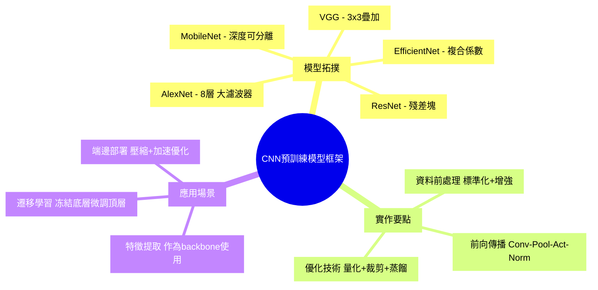

---
tags:
  - AI_system
  - deep-learning
  - cnn
  - pretraining
date: 2026-06-12
---

# CNN 預訓練模型框架 (AlexNet 到 EfficientNet)

> 原始筆記：[[AI_system/好用的深度學習CNN預訓練模型框架總整理: 從AlexNet到EfficientNet(ML 隨筆).md]]

## 核心概念
本文介紹深度學習中常見的 CNN 預訓練模型框架，從經典的 AlexNet 到現代的 EfficientNet 系列，並結合 ML 隨筆的觀點，說明各模型的結構特點與適用場景。

## 模型拓撲架構 ➡️ 資料前處理與張量維度 ➡️ 前向傳播推理 ➡️ 吞吐量與硬體開銷最佳化

### 模型拓撲架構
- AlexNet: 8層網路，使用大尺寸濾波器 (11x11, 5x5, 3x3)，首次使用 ReLU 激活函數和 Dropout
- VGG: 使用非常小的 3x3 濾波器疊加，增加網路深度但保持濾波器大小一致
- ResNet: 引入殘差塊 (Residual Block)，解決深度網路的梯度消失問題
- MobileNet: 使用深度可分離卷積 (Depthwise Separable Convolution) 大幅減少計算量和參數數量
- EfficientNet: 使用複合係數 (Compound Coefficient) 同等縮放網路寬度、深度和解析度

### 資料前處理與張量維度
- 圖像標準化：將像素值縮放至 [0,1] 或 [-1,1] 範圍，並減去 ImageNet 平均值
- 資料增強：隨機裁剪、翻轉、旋轉、顏色擾動等技術增加訓練資料多樣性
- 張量維度：通常使用 NCHW (Batch, Channel, Height, Width) 或 NHWC 格式，依據硬體優化選擇
- 批次大小：根據 GPU 顯存容量調整，影響收斂穩定性和訓練速度

### 前向傳播推理
- 卷積層：Feature extraction 通过滑動窗口計算 dot product
- 池化層：最大池化或平均池化降低空間維度
- 激活函數：ReLU 及其變體 (Leaky ReLU, ELU, Swish) 引入非線性
- 正規化層：Batch Normalization 或 Layer Normalization 穩定訓練過程
- 全連接層：特徵映射到最終輸出維度

### 吞吐量與硬體開銷最佳化
- 混合精度訓練：使用 FP16 加速運算同時保持數值穩定性
- 梯度累積：在記憶體有限時將大批次分割為多個小批次
- 模型裁剪：移除冗餘神經元和連結減少模型大小
- 知識蒸餾：使用大模型教導小模型以獲得更好效能與大小的平衡
- 硬體加速：利用 Tensor Core、GPU 核心專用指令加速矩陣運算

## Mermaid 心智圖

## 參考文獻
- AlexNet: <https://papers.nips.cc/paper/2012/file/c399862d3b9d6b76c8436e924a68c45b-Paper.pdf>
- EfficientNet: <https://arxiv.org/abs/1905.11946>
- 深度學習框架總覽 (ML 隨筆)：<https://kilong31442.medium.com/%E5%A5%BD%E7%94%A8%E7%9A%84%E6%B7%B1%E5%BA%A6%E5%AD%B8%E7%BF%92cnn%E9%A0%90%E8%A8%93%E7%B7%B4%E6%A8%A1%E5%9E%8B%E6%A1%86%E6%9E%B6%E7%B8%BD%E6%95%B4%E7%90%86-%E5%BE%9Ealexnet%E5%88%B0efficientnet-ml-%E9%9A%A8%E7%AD%86-f2ccb7a65621>