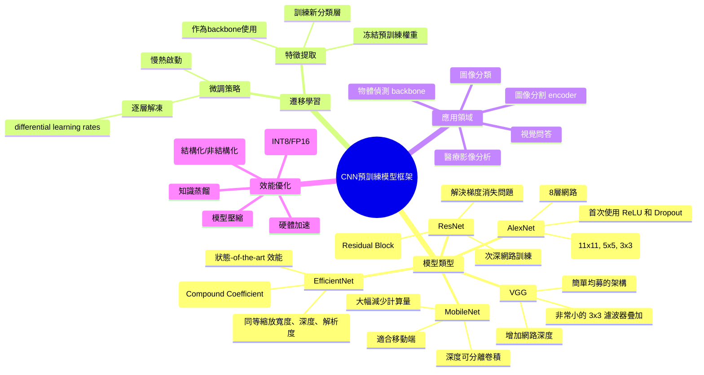

# 深度學習CNN預訓練模型框架總整理

[[AI_system/好用的深度學習CNN預訓練模型框架總整理: 從AlexNet到EfficientNet(ML 隨筆).md]]

## 核心概念
本文介紹深度學習中常見的 CNN 預訓練模型框架，從經典的 AlexNet 到現代的 EfficientNet 系列，並結合 ML 隨筆的觀點，說明各模型的結構特點與適用場景。文章強調了在遷移學習中選擇適當預訓練模型的重要性，並提供了不同模型在計算效率、準確性和資源消耗方面的比較。

## 人工智慧系統領域專章
### 模型拓撲架構
不同CNN架構在設計哲学和结构上有显著差异。Alexnet使用大尺寸卷積核与Dropout；VGG通过堆叠小卷積核增加网路深度；ResNet引入残差连接解决梯度消失问题；MobileNet采用深度可分离卷積大幅降低计算量；EfficientNet则通过复合系数平衡网路宽度、深度和分辨率。

### 資料前處理與張量維度
在Image等級任务中，输入图像需要进行标准化处理，通常将像素值缩放到[0, 1]或[-1, 1]范围，并减去数据集平均值。数据增强技术如随机裁剪、水平翻转、旋转和颜色抖动被广泛使用以增加训练数据多样性。张量维度方面，NCHW格式在GPU并行计算中通常具有更好的性能，而NHWC格式在某些内存访问模式下可能更优。

### 前向傳播推理
CNN的前向传播过程包括卷積操作、激活函数、池化和全连接层。卷積层通过滑动窗口计算特征图；池化层降低空间维度同时保留重要信息；激活函数引入非线性特征；正则化层如批标准化 stabilizing the training process；全连接层将特征映射到最终输出。

### 吞吐量與硬體開銷最佳化
为提高训练和推理效率，可以采用混合精度训练（FP16）减少显存占用；梯度累积在显存受限时将大批次分割为多个小批次；模型裁剪移除冗余神经元以降低模型复杂度；知识蒸馏用大模型指导小模型训练；硬件加速利用Tensor Core等专用单元加速矩阵运算；批次大小根据显存容量动态调整以平衡收敛速度和稳定性。

## Mermaid 心智圖


## C++ 實作範例（無 STL）
以下示範一個簡單的 3x3 卷積操作實作，使用原始指標操作而非 STL 容器：

```cpp
#include <cuda_runtime.h>
#include <cstdlib>

// 簡單的 3x3 卷積核函數
__global__ void conv2d_kernel(
    const float* input,      // 輸入特徵圖 [N*C*H*W]
    const float* weight,     // 卷積核 [OutC*InC*KH*KW]
    float* output,           // 輸出特徵圖 [N*OutC*OH*OW]
    const float* bias,       // 偏置項 [OutC]
    int N, int InC, int H, int W,  // 輸入維度
    int OutC, int KH, int KW,      // 卷積核維度
    int PH, int PW,                // 填充
    int SH, int SW                 // 步長
) {
    // 計算輸出維度
    int OH = (H + 2 * PH - KH) / SH + 1;
    int OW = (W + 2 * PW - KW) / SW + 1;
    
    // 計算全局執行緒 ID
    int idx = blockIdx.x * blockDim.x + threadIdx.x;
    int pixels_per_output = OH * OW;
    int outputs_per_channel = N * OutC * pixels_per_output;
    
    if (idx >= outputs_per_channel) return;
    
    // 解開多維索引 [n, out_c, oh, ow]
    int n = idx / (OutC * pixels_per_output);
    int out_c = (idx % (OutC * pixels_per_output)) / pixels_per_output;
    int oh = (idx % pixels_per_output) / OW;
    int ow = idx % OW;
    
    // 初始化輸出值
    float sum = 0.0f;
    
    // 執行 3x3 卷積運算
    for (int kh = 0; kh < KH; kh++) {
        for (int kw = 0; kw < KW; kw++) {
            int h_in = oh * SH - PH + kh;
            int w_in = ow * SW - PW + kw;
            
            // 檢查邊界
            if (h_in >= 0 && h_in < H && w_in >= 0 && w_in < W) {
                for (int in_c = 0; in_c < InC; in_c++) {
                    // 輸入特徵圖索引
                    int input_idx = n * (InC * H * W) + in_c * (H * W) + h_in * W + w_in;
                    // 卷積核索引
                    int weight_idx = out_c * (InC * KH * KW) + in_c * (KH * KW) + kh * KW + kw;
                    
                    sum += input[input_idx] * weight[weight_idx];
                }
            }
        }
    }
    
    // 添加偏置並儲存結果
    int output_idx = n * (OutC * OH * OW) + out_c * (OH * OW) + oh * OW + ow;
    output[output_idx] = sum + bias[out_c];
}

// 主機端啟動函式
void launch_conv2d(
    const float* d_input,
    const float* d_weight,
    float* d_output,
    const float* d_bias,
    int N, int InC, int H, int W,
    int OutC, int KH, int KW,
    int PH, int PW,
    int SH, int SW
) {
    // 計算輸出維度
    int OH = (H + 2 * PH - KH) / SH + 1;
    int OW = (W + 2 * PW - KW) / SW + 1;
    
    int total_output_elements = N * OutC * OH * OW;
    int blockSize = 256;
    int gridSize = (total_output_elements + blockSize - 1) / blockSize;
    
    conv2d_kernel<<<gridSize, blockSize>>>(
        d_input, d_weight, d_output, d_bias,
        N, InC, H, W, OutC, KH, KW, PH, PW, SH, SW
    );
    cudaDeviceSynchronize();
}
```

## Python 純標準庫範例
以下示範使用純 Python 實作簡單的卷積操作，僅使用標準庫而非 NumPy 或深度學習框架：

```python
from typing import List, Tuple

def conv2d_simple(
    input: List[List[List[List[float]]]],  # [N][InC][H][W]
    weight: List[List[List[List[float]]]],  # [OutC][InC][KH][KW]
    bias: List[float],                      # [OutC]
    stride: Tuple[int, int] = (1, 1),
    padding: Tuple[int, int] = (0, 0)
) -> List[List[List[List[float]]]]:
    """
    簡單的 2D 卷積實作（僅用於教育目的）
    實際應用應該使用優化的庫如 PyTorch 或 TensorFlow
    """
    # 獲取維度
    N = len(input)
    InC = len(input[0])
    H = len(input[0][0])
    W = len(input[0][0][0])
    
    OutC = len(weight)
    KH = len(weight[0][0])
    KW = len(weight[0][0][0])
    
    SH, SW = stride
    PH, PW = padding
    
    # 計算輸出維度
    OH = (H + 2 * PH - KH) // SH + 1
    OW = (W + 2 * PW - KW) // SW + 1
    
    # 初始化輸出張量
    output = [[[[0.0 for _ in range(OW)] for _ in range(OH)] 
                for _ in range(OutC)] for _ in range(N)]
    
    # 執行卷積運算
    for n in range(N):
        for out_c in range(OutC):
            for oh in range(OH):
                for ow in range(OW):
                    sum_val = 0.0
                    for kh in range(KH):
                        for kw in range(KW):
                            h_in = oh * SH - PH + kh
                            w_in = ow * SW - PW + kw
                            
                            # 檢查邊界
                            if 0 <= h_in < H and 0 <= w_in < W:
                                for in_c in range(InC):
                                    sum_val += input[n][in_c][h_in][w_in] * weight[out_c][in_c][kh][kw]
                    
                    # 添加偏置
                    output[n][out_c][oh][ow] = sum_val + bias[out_c]
    
    return output

# 使用範例和測試
if __name__ == "__main__":
    # 創建一個簡單的測試案例：1x1x4x4 輸入，1x1x3x3 卷積核
    input_tensor = [[[[1.0, 2.0, 3.0, 4.0],
                      [5.0, 6.0, 7.0, 8.0],
                      [9.0, 10.0, 11.0, 12.0],
                      [13.0, 14.0, 15.0, 16.0]]]]
    
    weight_tensor = [[[[1.0, 0.0, -1.0],
                       [1.0, 0.0, -1.0],
                       [1.0, 0.0, -1.0]]]]
    
    bias_tensor = [0.0]
    
    # 執行卷積
    output = conv2d_simple(input_tensor, weight_tensor, bias_tensor, stride=(1,1), padding=(1,1))
    
    print("輸入張量形狀:", len(input_tensor), "x", len(input_tensor[0]), "x", len(input_tensor[0][0]), "x", len(input_tensor[0][0][0]))
    print("輸出張量形狀:", len(output), "x", len(output[0]), "x", len(output[0][0]), "x", len(output[0][0][0]))
    print("輸出結果:")
    for oh in range(len(output[0][0])):
        row = []
        for ow in range(len(output[0][0][0])):
            row.append(f"{output[0][0][oh][ow]:.2f}")
        print(" ".join(row))
```

## 參考資料
[[AI_system/好用的深度學習CNN預訓練模型框架總整理: 從AlexNet到EfficientNet(ML 隨筆).md]]

1. AlexNet: https://papers.nips.cc/paper/2012/file/c399862d3b9d6b76c8436e924a68c45b-Paper.pdf
2. EfficientNet: https://arxiv.org/abs/1905.11946
3. 深度學習框架總覽 (ML 隨筆)：https://kilong31442.medium.com/%E5%A5%BD%E7%94%A8%E7%9A%84%E6%B7%B1%E5%BA%A6%E5%AD%B8%E7%BF%92cnn%E9%A0%90%E8%A8%93%E7%B7%B4%E6%A8%A1%E5%9E%8B%E6%A1%86%E6%9E%B6%E7%B8%BD%E6%95%B4%E7%90%86-%E5%BE%9Ealexnet%E5%88%B0efficientnet-ml-%E9%9A%A8%E7%AD%86-f2ccb7a65621

## 相關筆記
- [[AI_system/cnn-reference]]
- [[AI_system/deep-learning-concepts]]
- [[AI_system/transfer-learning]]
- [[AI_system/model-optimization]]