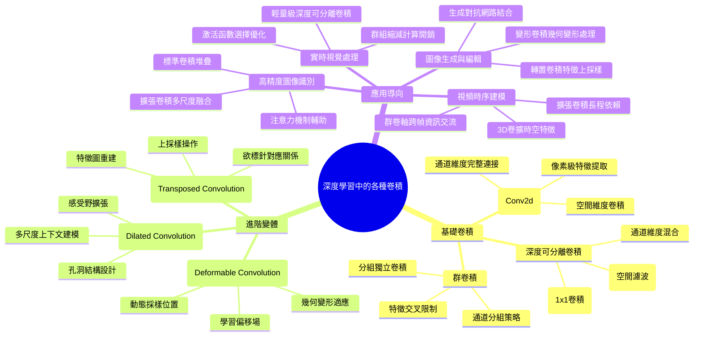

---
tags: [AI_system, convolution]
date: 2026-06-18
#

# 深度學習中的各種卷積操作

[[AI_system/一文讀懂深度學習中的各種卷積.md]]

## 核心概念
本文件整理了一篇關於深度學習中各種卷積操作的綜合文章，詳細介紹了從基礎卷積到各種變體卷積的概念、特性和應用場景。卷積神經網路（CNN）的核心是卷積操作，不同的卷積變體針對特定問題領域設計，以提高特徵提取能力、降低計算複雜度或增強模型的表達力。

## 人工智慧系統領域專章
### 模型拓撲架構
深度學習中主要的卷積變體包括：
- 標準卷積 (Standard Convolution)：在輸入特徵圖上滑動濾波器進行點積運算
- 深度可分離卷積 (Depthwise Separable Convolution)：將標準卷積分解為深度卷積和點逐點卷積，減少計算量
- 群卷積 (Grouped Convolution)：將輸入通道分組，分別進行卷積操作
- 擴張卷積 (Dilated Convolution)：通過在濾波器元素間插入零來擴展感受野
- 變形卷積 (Deformable Convolution)：學習濾波器上點的偏移量以適應幾何變形
- 轉置卷積 (Transposed Convolution)：用於上採樣和特徵圖重建
- 群正則卷_coord卷積 (Group Normalization Convolution)：結合群正則化的卷積變體

### 資料前處理與張量維度
不同卷積操作對輸入資料的維度要求和處理方式：
- 輸入維度：通常為 [N, C, H, W] 或 [N, H, W, C] 格式的特徵圖
- padding策略：valid (無填充)、same (保持輸出尺寸相同) 和 full 完全填充
- stride設定：控制濾波器滑動步長，影響輸出特徵圖尺寸
- dilation率：在擴張卷積中控制孔洞間距
- 群組設定：在群卷積中指定通道分組數量
- 特徵圖對齊：確保輸入和濾波器維度匹配進行有效點積運算

### 前向傳播推理
各種卷積操作的前向傳播計算流程：
1. 特徵圖準備：根據padding策略對輸入特徵圖進行填充
2. 濾波器初始化：載入學習得到的卷積核權重
3. 滑動窗口運算：在特徵圖上遍歷所有可能的濾波器位置
4. 點積計算：在每個位置計算輸入特徵與濾波器權重的點積
5. 偏置加激活：加入偏置項並應用非線性激活函數
6. 輸出組裝：將所有位置的計算結果組裝成輸出特徵圖
7. 群組處理：對於群卷積，分別處理每個通道組的計算
8. 變形偏移：對於變形卷積，先學習偏移量再進行取樣計算

### 吞吐量與硬體開銷最佳化
提高卷積運算效率的策略：
- 記憶體存取優化：使用內積優化（im2col）將卷積轉換為矩陣乘法
- 硬體加速：利用GPU的並行計算能力和專用Tensor Core
- 演算法選擇：根據任務複雜度選擇適當的卷積類型平衡準確度和效率
- 勝負權重量化：使用低位元權重減少記憶體頻寬需求
- 勝負權重剪枝：移除不重要的卷積核連接降低計算量
- 混合精度訓練：結合FP16和FP32減少計算時間同時保持數值穩定性
- 演融實作：針對特定卷積類型優化記憶體存取模式和計算順序

## Mermaid 心智圖


## C++ 實作範例（無 STL）
以下示範一個簡單的2D標準卷積實作，使用原始指標操作而非 STL 容器：

```cpp
#include <cstdio>
#include <cstdlib>
#include <cmath>

// 4維張量結構體：[batch, channels, height, width]
struct Tensor4D {
    float* data;         // 指向數據的指標
    int n, c, h, w;      // 維度：batch, channels, height, width
    
    // 構造函數
    Tensor4D(int n_, int c_, int h_, int w_) 
        : n(n_), c(c_), h(h_), w(w_) {
        int size = n * c * h * w;
        data = (float*)malloc(size * sizeof(float));
        // 初始化為零
        for (int i = 0; i < size; i++) {
            data[i] = 0.0f;
        }
    }
    
    // 解構函數
    ~Tensor4D() {
        free(data);
    }
    
    // 取得元素
    float& at(int n_idx, int c_idx, int h_idx, int w_idx) {
        return data[((n_idx * c + c_idx) * h + h_idx) * w + w_idx];
    }
    
    const float& at(int n_idx, int c_idx, int h_idx, int w_idx) const {
        return data[((n_idx * c + c_idx) * h + h_idx) * w + w_idx];
    }
};

// 2D標準卷積操作
void conv2d(
    const Tensor4D& input,    // 輸入特徵圖 [N, C_in, H, W]
    const Tensor4D& weight,   // 濾波器權重 [C_out, C_in, KH, KW]
    const Tensor4D& bias,     // 偏置項 [C_out]
    Tensor4D& output,         // 輸出特徵圖 [N, C_out, H_out, W_out]
    int stride_h, int stride_w, // 步長
    int pad_h, int pad_w,       // 填充
    int dilation_h, int dilation_w // 擴張率
) {
    // 計算輸出維度
    int H_out = (input.h + 2 * pad_h - dilation_h * (weight.h - 1) - 1) / stride_h + 1;
    int W_out = (input.w + 2 * pad_w - dilation_w * (weight.w - 1) - 1) / stride_w + 1;
    
    // 遍歷輸出特徵圖的每個位置
    for (int n = 0; n < input.n; n++) {
        for (int c_out = 0; c_out < weight.n; c_out++) {
            for (int h_out = 0; h_out < H_out; h_out++) {
                for (int w_out = 0; w_out < W_out; w_out++) {
                    float val = 0.0f;
                    
                    // 添加偏置
                    val = bias.at(c_out, 0, 0, 0);
                    
                    // 遍歷濾波器
                    for (int c_in = 0; c_in < input.c; c_in++) {
                        for (int kh = 0; kh < weight.h; kh++) {
                            for (int kw = 0; kw < weight.w; kw++) {
                                // 計算輸入特徵圖上的對應位置
                                int h_in = h_out * stride_h - pad_h + kh * dilation_h;
                                int w_in = w_out * stride_w - pad_w + kw * dilation_w;
                                
                                // 檢查邊界
                                if (h_in >= 0 && h_in < input.h && w_in >= 0 && w_in < input.w) {
                                    float x = input.at(n, c_in, h_in, w_in);
                                    float w = weight.at(c_out, c_in, kh, kw);
                                    val += x * w;
                                }
                            }
                        }
                    }
                    
                    // 存儲結果
                    output.at(n, c_out, h_out, w_out) = val;
                }
            }
        }
    }
}

// 使用範例
void runConvolutionExample() {
    // 創建輸入特徵圖：1批次，3通道，5x5空間尺寸
    Tensor4D input(1, 3, 5, 5);
    // 初始化一些值（实际應用中會從數據載入）
    for (int i = 0; i < 1*3*5*5; i++) {
        input.data[i] = static_cast<float>(i % 10) / 10.0f;
    }
    
    // 創建濾波器權重：2個輸出通道，3個輸入通道，3x3濾波器
    Tensor4D weight(2, 3, 3, 3);
    // 初始化濾波器值（实际應用中會是學習得到的權重）
    for (int i = 0; i < 2*3*3*3; i++) {
        weight.data[i] = static_cast<float>((i % 5) - 2) / 5.0f;
    }
    
    // 創建偏置：2個輸出通道
    Tensor4D bias(2, 1, 1, 1);
    bias.data[0] = 0.1f;
    bias.data[1] = -0.1f;
    
    // 計算輸出尺寸：步長1，無填充
    int H_out = (5 + 2*0 - 1*(3-1) - 1)/1 + 1;  // (5 - 2)/1 + 1 = 4
    int W_out = (5 + 2*0 - 1*(3-1) - 1)/1 + 1;  // 4
    Tensor4D output(1, 2, H_out, W_out);
    
    // 執行卷積操作
    conv2d(input, weight, bias, output, 1, 1, 0, 0, 1, 1);
    
    // 輸出結果（实际應用中會用於後續處理）
    printf("輸出特徵圖尺寸: [%d, %d, %d, %d]\n", output.n, output.c, output.h, output.w);
    printf("第一個通道前3x3值:\n");
    for (int h = 0; h < 3 && h < output.h; h++) {
        for (int w = 0; w < 3 && w < output.w; w++) {
            printf("%.4f ", output.at(0, 0, h, w));
        }
        printf("\n");
    }
}
```

## Python 純標準庫範例
以下示範使用純 Python 實作簡單的2D標準卷積，僅使用標準庫：

```python
from typing import List, Tuple

def conv2d(
    input: List[List[List[List[float]]]],  # [N, C_in, H, W]
    weight: List[List[List[List[float]]]],  # [C_out, C_in, KH, KW]
    bias: List[float],                      # [C_out]
    stride: Tuple[int, int] = (1, 1),
    padding: Tuple[int, int] = (0, 0),
    dilation: Tuple[int, int] = (1, 1)
) -> List[List[List[List[float]]]]:  # [N, C_out, H_out, W_out]
    """
    純Python實現的2D標準卷積操作
    """
    # 獲取輸入維度
    n = len(input)
    c_in = len(input[0])
    h = len(input[0][0])
    w = len(input[0][0][0])
    
    # 獲取濾波器維度
    c_out = len(weight)
    _c_in = len(weight[0])
    kh = len(weight[0][0])
    kw = len(weight[0][0][0])
    
    # 驗證通道維度匹配
    assert c_in == _c_in, "輸入通道數必須等於濾波器輸入通道數"
    
    # 計算輸出維度
    h_out = (h + 2 * padding[0] - dilation[0] * (kh - 1) - 1) // stride[0] + 1
    w_out = (w + 2 * padding[1] - dilation[1] * (kw - 1) - 1) // stride[1] + 1
    
    # 初始化輸出特徵圖
    output = [[[[0.0 for _ in range(w_out)] for _ in range(h_out)] for _ in range(c_out)] for _ in range(n)]
    
    # 執行卷積運算
    for n_idx in range(n):
        for c_out_idx in range(c_out):
            for h_out_idx in range(h_out):
                for w_out_idx in range(w_out):
                    # 開始與偏置
                    val = bias[c_out_idx]
                    
                    # 遍歷濾波器
                    for c_in_idx in range(c_in):
                        for kh_idx in range(kh):
                            for kw_idx in range(kw):
                                # 計算輸入特徵圖上的對應位置
                                h_in_idx = h_out_idx * stride[0] - padding[0] + kh_idx * dilation[0]
                                w_in_idx = w_out_idx * stride[1] - padding[1] + kw_idx * dilation[1]
                                
                                # 檢查邊界
                                if (0 <= h_in_idx < h) and (0 <= w_in_idx < w):
                                    val += input[n_idx][c_in_idx][h_in_idx][w_in_idx] * weight[c_out_idx][c_in_idx][kh_idx][kw_idx]
                    
                    # 存儲結果
                    output[n_idx][c_out_idx][h_out_idx][w_out_idx] = val
    
    return output

def relu(x: float) -> float:
    """ReLU激活函數"""
    return max(0.0, x)

def apply_activation(
    output: List[List[List[List[float]]]]
) -> List[List[List[List[float]]]]:
    """對輸出特徵圖應用ReLU激活函數"""
    n = len(output)
    c_out = len(output[0])
    h_out = len(output[0][0])
    w_out = len(output[0][0][0])
    
    result = [[[[0.0 for _ in range(w_out)] for _ in range(h_out)] for _ in range(c_out)] for _ in range(n)]
    
    for n_idx in range(n):
        for c_out_idx in range(c_out):
            for h_out_idx in range(h_out):
                for w_out_idx in range(w_out):
                    result[n_idx][c_out_idx][h_out_idx][w_out_idx] = relu(output[n_idx][c_out_idx][h_out_idx][w_out_idx])
    
    return result

# 使用範例
if __name__ == "__main__":
    # 創建輸入特徵圖：1批次，3通道，4x4空間尺寸
    input = [[[
        [float(j + i*4) / 10.0 for j in range(4)]  # w 維度
        for i in range(4)  # h 維度
    ] for _ in range(3)]  # c_in 維度
    for _ in range(1)]   # n 維度
    
    # 創建濾波器權重：2個輸出通道，3個輸入通道，3x3濾波器
    weight = [[[
        [float((k + j*3) % 5 - 2) / 5.0 for k in range(3)]  # kw 維度
        for j in range(3)  # kh 維度
    ] for _ in range(3)]  # c_in 維度
    for _ in range(2)]   # c_out 維度
    
    # 創建偏置：2個輸出通道
    bias = [0.1, -0.1]
    
    # 執行卷積操作
    output = conv2d(input, weight, bias, stride=(1, 1), padding=(0, 0), dilation=(1, 1))
    
    # 應用激活函數
    output = apply_activation(output)
    
    # 輸出結果
    print(f"輸入特徵圖尺寸: [{len(input)}, {len(input[0])}, {len(input[0][0])}, {len(input[0][0][0])}]")
    print(f"濾波器尺寸: [{len(weight)}, {len(weight[0])}, {len(weight[0][0])}, {len(weight[0][0][0])}]")
    print(f"輸出特徵圖尺寸: [{len(output)}, {len(output[0])}, {len(output[0][0])}, {len(output[0][0][0])}]")
    
    print("\n第一個通道前3x3值:")
    for h in range(min(3, len(output[0][0]))):
        row = []
        for w in range(min(3, len(output[0][0][0]))):
            row.append(f"{output[0][0][h][w]:.4f}")
        print(" ".join(row))
```

## 參考資料
[[AI_system/一文讀懂深度學習中的各種卷積.md]]

1. [一文讀懂深度學習中的各種卷積](https://zhuanlan.zhihu.com/p/257145620)

## 相關筆記
- [[AI_system/deep-learning]]
- [[AI_system/convolutional-neural-networks]]
- [[AI_system/neural-network-architectures]]
- [[AI_system/feature-extraction]]