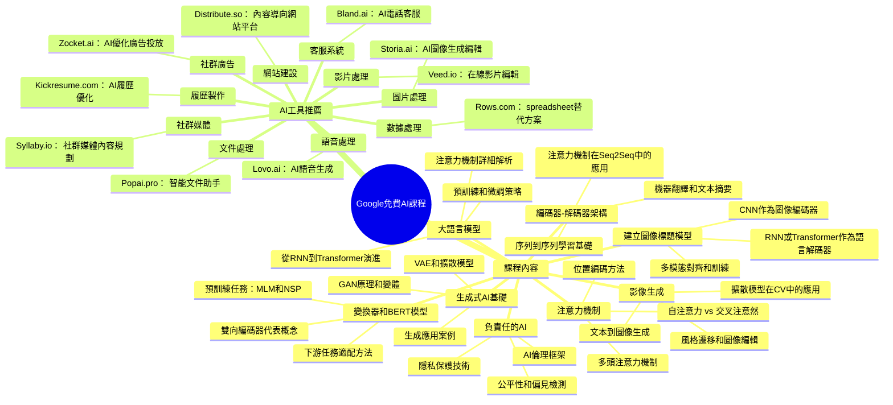

# Google 免費 AI 課程資源

[[AI_system/Google 八堂免費的AI課程.md]]

## 核心概念
本文件整理了Google提供的八堂免費AI課程，涵蓋從生成式AI基礎到變換器模型和BERT，以及實用的AI工具推薦。這些課程適合希望系統性學習AI知識的開發者和研究者，提供了從理論基礎到實際應用的完整學習路徑。此外還包括2024年值得嘗試的10個AI工具橫跨數據處理、語音、影片、圖片、客服、文件、履歷、網站、社群廣告和社群媒體等多個領域。

## 人工智慧系統領域專章
### 模型拓撲架構
雖然本文件主要是課程資源清單，但所涵蓋的課程內容包括了現代AI系統的核心架構：
- 生成式AI基礎：介紹生成對抗網路(GAN)、變分自編碼器(VAE)和擴散模型等生成模型的基本原理
- 大語言模型：循環神經網路(RNN)、長短期記憶網路(LSTM)以及變換器(Transformer)架構的演進
- 注意力機制：自注意力和交叉注意力機制，是現代NLP和CV模型的關鍵組件
- 編碼器-解碼器架構：序列到序列學習的基礎架構，廣泛應用於機器翻譯、文本摘要等任務
- 變換器模型和BERT：雙向編碼器表示，革命化了自然語言處理領域

### 資料前處理與張量維度
課程中涵蓋的資料前處理知識包括：
- 不同模態資料的標準化技術：文本的詞嵌入、圖像的像素正規化、語音的頻譜特徵等
- 張量維度管理：批次處理中的NCHW vs NHWC格式選擇，影響記憶體存取效能和硬體加速效率
- 資料增強技術：針對圖像、文本和語音資料的變換方法，提高模型泛化能力
- 特徵工程：從原始資料提取有意義特徵的方法和技巧

### 前向傳播推理
課程內容涵蓋了不同模型的前向傳播過程：
- 卷積神經網路：特徵提取 melalui卷積和池化操作的空間層次特徵學習
- 循環神經網路：時間序列資料的遞歸資訊處理和隱藏狀態傳遞
- 變換器架構：自注意力機制的查詢-鍵-值運算以及位置編碼的注入
- 生成模型：從潛在空間樣本生成資料的過程，包括逆向運算和解碼步驟

### 吞吐量與硬體開銷最佳化
課程中可能涵蓋的優化知識包括：
- 批次大小優化：根據顯存容量和收斂速度平衡訓練效率
- 混合精度訓練：使用FP16減少運算量同時保持數值穩定性
- 模型並行策略：數據並行vs模型並行，根據模型大小選擇適當策略
- 梯度檢查點：用計算時間換取記憶體空間的技術
- 推理加速：量化、裁剪和知識蒸餾等模型壓縮技術

## Mermaid 心智圖


## C++ 實作範例（無 STL）
以下示範一個簡單的向量點積運算實作，使用原始指標操作而非 STL 容器（這是許多機器學習算法的基礎運算）：

```cpp
#include <cuda_runtime.h>
#include <cstdlib>

// 向量點積核函數
__global__ void dot_product_kernel(
    const float* a,      // 輸入向量 a [n]
    const float* b,      // 輸入向量 b [n]
    float* result,       // 輸出結果 [1] (使用原子操作)
    int n                // 向量長度
) {
    int idx = blockIdx.x * blockDim.x + threadIdx.x;
    if (idx >= n) return;
    
    // 計算局部乘積
    float local_product = a[idx] * b[idx];
    
    // 使用原子加法進行全域归约
    atomicAdd(result, local_product);
}

// 主機端啟動函式
float launch_dot_product(
    const float* d_a,
    const float* d_b,
    int n
) {
    // 在設備端分配結果空間
    float* d_result;
    cudaMalloc(&d_result, sizeof(float));
    cudaMemset(d_result, 0, sizeof(float));
    
    // 設定核函數執行配置
    int blockSize = 256;
    int gridSize = (n + blockSize - 1) / blockSize;
    
    // 執行核函數
    dot_product_kernel<<<gridSize, blockSize>>>(d_a, d_b, d_result, n);
    cudaDeviceSynchronize();
    
    // 複製結果回主機端
    float h_result;
    cudaMemcpy(&h_result, d_result, sizeof(float), cudaMemcpyDeviceToHost);
    
    // 釋放設備端記憶體
    cudaFree(d_result);
    
    return h_result;
}
```

## Python 純標準庫範例
以下示範使用純 Python 實作簡單的矩陣乘法，僅使用標準庫而非 NumPy：

```python
from typing import List, Tuple

def matmul_simple(
    A: List[List[float]],  # m x n 矩陣
    B: List[List[float]]   # n x p 矩陣
) -> List[List[float]]:
    """
    簡單的矩陣乘法實作（僅用於教育目的）
    實際應用應該使用優化的庫如 NumPy 或 PyTorch
    """
    # 獲取矩陣維度
    m = len(A)
    n = len(A[0]) if A else 0
    p = len(B[0]) if B else 0
    
    # 驗證矩陣維度是否匹配
    if len(B) != n:
        raise ValueError(f"矩陣維度不匹配: A是 {m}x{n}, B是 {len(B)}x{p}")
    
    # 初始化結果矩陣 (m x p)
    result = [[0.0 for _ in range(p)] for _ in range(m)]
    
    # 執行矩陣乘法
    for i in range(m):
        for j in range(p):
            for k in range(n):
                result[i][j] += A[i][k] * B[k][j]
    
    return result

def transpose_matrix(
    M: List[List[float]]  # m x n 矩陣
) -> List[List[float]]:   # n x m 矩陣
    """
    矩陣轉置實作
    """
    if not M:
        return []
    
    m = len(M)
    n = len(M[0])
    
    result = [[0.0 for _ in range(m)] for _ in range(n)]
    
    for i in range(m):
        for j in range(n):
            result[j][i] = M[i][j]
    
    return result

# 使用範例和測試
if __name__ == "__main__":
    # 創建兩個簡單的矩陣進行測試
    A = [
        [1.0, 2.0, 3.0],
        [4.0, 5.0, 6.0]
    ]  # 2x3 矩陣
    
    B = [
        [7.0, 8.0],
        [9.0, 10.0],
        [11.0, 12.0]
    ]  # 3x2 矩陣
    
    # 執行矩陣乘法
    result = matmul_simple(A, B)
    
    print("矩陣 A:")
    for row in A:
        print(row)
    
    print("\n矩陣 B:")
    for row in B:
        print(row)
    
    print("\n矩陣 A x B:")
    for row in result:
        print([f"{x:.2f}" for x in row])
    
    # 測試轉置
    AT = transpose_matrix(A)
    print("\n矩陣 A 轉置:")
    for row in AT:
        print(row)
```

## 參考資料
[[AI_system/Google 八堂免費的AI課程.md]]

1. 生成式AI基本介紹：https://www.cloudskillsboost.google/course_templates/536
2. 大語言模型介紹：https://www.cloudskillsboost.google/course_templates/539
3. 負責任的AI介紹：https://www.cloudskillsboost.google/course_templates/554
4. 影像生成介紹：https://www.cloudskillsboost.google/course_templates/541
5. 編碼器-解碼器架構：https://www.cloudskillsboost.google/course_templates/543
6. 注意力機制：https://www.cloudskillsboost.google/course_templates/537
7. 變換器模型和BERT模型：https://www.cloudskillsboost.google/course_templates/538
8. 建立圖像標題模型：https://www.cloudskillsboost.google/course_templates/542

## 相關筆記
- [[AI_system/ai-education]]
- [[AI_system/machine-learning-courses]]
- [[AI_system/deep-learning-specialization]]
- [[AI_system/ai-tools-resources]]