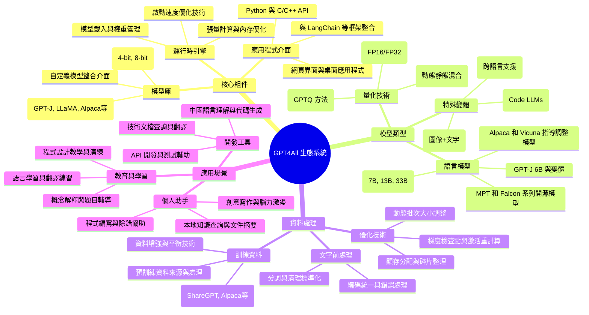

# GPT4All 本地大型語言模型生態系統

[[AI_system/gpt4all.md]]

## 核心概念
GPT4All 是一個開源生態系統，使使用者能夠在消費級硬體（包括筆記本電腦和桌上型電腦）上運行大型語言模型（LLM）。它提供了統一的介面來存取、訓練和部署各種開源 LLM，降低了進入門檻，使個人開發者和小型團隊也能擁有類似 ChatGPT 的體驗。GPT4All 包含模型庫、訓練框架和應用程式介面（API），支援多種語言模型架構和量化技術以適應不同硬體資源限制。

## 人工智慧系統領域專章
### 模型拓撲架構
GPT4All 支援的模型拓撲包括：
- 基於變換器的自回歸語言模型：GPT-J、GPT-NeoX、LLaMA 等架構的變體
- 量化模型：4-bit、8-bit 和混合精度量化以減少記憶體佔用
- 指導調整模型：經過指導數據微調以提升追蹤指令和對話能力的模型
- 多模態擴展：結合視覺或語音模組的語言模型變體
- 模型融合技術：專家混合（MoE）和模型併發等進階架構

### 資料前處理與張量維度
GPT4All 中的資料處理知識包括：
- 文字標準化：UTF-8 編碼標準化、空白字元處理和標點符號統一
- 詞彙表處理：Byte Pair Encoding (BPE) 或 WordPiece 詞彙表載入和應用
- 批次處理：動態批次大小調整以適應不同序列長度和記憶體限制
- 位置編碼：絕對位置編碼、相對位置編碼和旋轉位置編碼 (RoPE) 實作
- 記憶體優化：鍵值快取管理、梯度檢查點和激活重計算以減少顯存使用

### 前向傳播推理
GPT4All 推理過程中的關鍵技術包括：
- 權重載入：量化權重的反序列化和設備內存分配
- 令牌化：文字到詞元的轉換和詞元到文字的解碼
- 自回歸生成：前向傳播循環以產生下一個詞元概率分布
- 採樣策略：貪婪搜索、光束搜索、Top-k 和 Top-p (nucleus) 採樣
- 效能優化：批次推理、快取重用和張量核心加速矩陣運算

### 吞吐量與硬體開銷最佳化
提高 GPT4All 系統效率的策略包括：
- 模型量化：使用 int4、int8 或混合精度減少記憶體佔用和運算量
- 持續批次：動態調整批次大小以平衡延遲和吞吐量
- 記憶體共享：在多個請求間共享模型權重以減少重複載入
- 管線化：重疊不同請求的前向傳播和後處理階段
- 硬體加速：利用 GPU、Apple Silicon 或其他專用加速器進行矩陣運算

## Mermaid 心智圖


## C++ 實作範例（無 STL）
以下示範一個簡單的語言模型權重載入實作，使用原始指標操作而非 STL 容器（這是 GPT4All 運行時引擎的核心部分）：

```cpp
#include <cuda_runtime.h>
#include <cstdlib>
#include <cstring>

// 模型權重塊結構體
struct WeightBlock {
    float* data;      // 權重數據指標
    size_t size;      // 元素數量
    bool is_quantized; // 是否為量化權重
    int quantization_bits; // 量化位數 (4, 8, 16等)
    float scale_factor;    // 反量化縮放因子
    float zero_point;      // 反量化零點
};

// 簡單的模型管理類
class SimpleLLM {
public:
    SimpleLLM() : num_layers_(0), hidden_size_(0), vocab_size_(0) {
        layers_ = nullptr;
        layer_sizes_ = nullptr;
    }
    
    ~SimpleLLM() {
        destroy();
    }
    
    // 初始化模型結構
    bool initialize(size_t num_layers, size_t hidden_size, size_t vocab_size) {
        destroy();
        
        num_layers_ = num_layers;
        hidden_size_ = hidden_size;
        vocab_size_ = vocab_size;
        
        // 為每一層分配空間
        layers_ = new WeightBlock*[num_layers];
        layer_sizes_ = new size_t[num_layers];
        
        if (!layers_ || !layer_sizes_) {
            destroy();
            return false;
        }
        
        // 初始化為空
        for (size_t i = 0; i < num_layers; i++) {
            layers_[i] = nullptr;
            layer_sizes_[i] = 0;
        }
        
        return true;
    }
    
    // 載入權重數據（簡化版本）
    bool load_weights(
        size_t layer_idx,
        const float* weight_data,
        size_t weight_count,
        bool quantized = false,
        int bits = 32,
        float scale = 1.0f,
        float zero_point = 0.0f
    ) {
        if (layer_idx >= num_layers_) return false;
        
        // 釋放現有權重（如果有的話）
        if (layers_[layer_idx]) {
            free(layers_[layer_idx]->data);
            free(layers_[layer_idx]);
        }
        
        // 建立新權重區塊
        WeightBlock* block = new WeightBlock();
        block->size = weight_count;
        block->is_quantized = quantized;
        block->quantization_bits = bits;
        block->scale_factor = scale;
        block->zero_point = zero_point;
        
        if (weight_count > 0) {
            block->data = (float*)malloc(weight_count * sizeof(float));
            if (!block->data) {
                free(block);
                return false;
            }
            
            // 複製權重數據
            memcpy(block->data, weight_data, weight_count * sizeof(float));
        } else {
            block->data = nullptr;
        }
        
        layers_[layer_idx] = block;
        layer_sizes_[layer_idx] = weight_count;
        return true;
    }
    
    // 釋放所有資源
    void destroy() {
        if (layers_) {
            for (size_t i = 0; i < num_layers_; i++) {
                if (layers_[i]) {
                    free(layers_[i]->data);
                    free(layers_[i]);
                }
            }
            delete[] layers_;
            layers_ = nullptr;
        }
        
        if (layer_sizes_) {
            delete[] layer_sizes_;
            layer_sizes_ = nullptr;
        }
        
        num_layers_ = 0;
        hidden_size_ = 0;
        vocab_size_ = 0;
    }
    
    // 獲取權重存取器（簡化版本）
    const WeightBlock* get_layer_weights(size_t layer_idx) const {
        if (layer_idx >= num_layers_) return nullptr;
        return layers_[layer_idx];
    }
    
private:
    WeightBlock** layers_;
    size_t* layer_sizes_;
    size_t num_layers_;
    size_t hidden_size_;
    size_t vocab_size_;
};

// 使用範例：載入並使用簡化的語言模型
void run_simple_llm_example() {
    // 建立模型實例
    SimpleLLM model;
    
    // 假設載入一個簡單的變換器模型：2 層，隱藏大小 256，詞彙表大小 1000
    if (!model.initialize(2, 256, 1000)) {
        // 初始化失敗處理
        return;
    }
    
    // 準備一些假的權重數據（實際應該從文件載入）
    const size_t weights_per_layer = 256 * 256; // 假設是方形權重矩陣
    float* layer_weights = (float*)malloc(weights_per_layer * sizeof(float));
    
    // 用一些假值填充權重
    for (size_t i = 0; i < weights_per_layer; i++) {
        layer_weights[i] = ((float)rand() / RAND_MAX) * 2.0f - 1.0f; // [-1, 1] 隨機值
    }
    
    // 載入第一層權重
    model.load_weights(0, layer_weights, weights_per_layer, false, 32, 1.0f, 0.0f);
    
    // 載入第二層權重（假設不同大小）
    const size_t bias_weights = 256;
    float* layer_bias = (float*)malloc(bias_weights * sizeof(float));
    for (size_t i = 0; i < bias_weights; i++) {
        layer_bias[i] = ((float)rand() / RAND_MAX) * 2.0f - 1.0f;
    }
    model.load_weights(0, layer_bias, bias_weights, false, 32, 1.0f, 0.0f); // 實際應該是不同層
    
    // 釋放臨時數據
    free(layer_weights);
    free(layer_bias);
    
    // 這裡 would typically proceed to run inference
    // 但為了示範目的，我們只展示載入部分
    
    // 當完成時清理資源
    model.destroy();
}
```

## Python 純標準庫範例
以下示範使用純 Python 實作簡單的語言模型語彙表管理，僅使用標準庫而非 NumPy 或第三方庫：

```python
import json
import os
from typing import Dict, List, Optional, Union
from collections import defaultdict

class Vocabulary:
    """語彙表管理類"""
    
    def __init__(self):
        self.word_to_idx: Dict[str, int] = {}
        self.idx_to_word: List[str] = []
        self.padding_token = "<pad>"
        self.unknown_token = "<unk>"
        self.begin_sentence_token = "<bos>"
        self.end_sentence_token = "<eos>"
        
        # 初始化特殊標記
        self._add_special_tokens()
    
    def _add_special_tokens(self):
        """添加特殊標記到詞彙表"""
        special_tokens = [
            self.padding_token,
            self.unknown_token,
            self.begin_sentence_token,
            self.end_sentence_token
        ]
        
        for token in special_tokens:
            if token not in self.word_to_idx:
                idx = len(self.idx_to_word)
                self.word_to_idx[token] = idx
                self.idx_to_word.append(token)
    
    def add_word(self, word: str) -> int:
        """添加單詞到詞彙表並返回其索引"""
        if word not in self.word_to_idx:
            idx = len(self.idx_to_word)
            self.word_to_idx[word] = idx
            self.idx_to_word.append(word)
        return self.word_to_idx[word]
    
    def get_index(self, word: str) -> int:
        """獲取單詞對應的索引，未知單詞返回 unknown_token 索引"""
        return self.word_to_idx.get(word, self.word_to_idx[self.unknown_token])
    
    def get_word(self, idx: int) -> str:
        """根據索引獲取對應的單詞，超出範圍返回 unknown_token"""
        if 0 <= idx < len(self.idx_to_word):
            return self.idx_to_word[idx]
        return self.idx_to_word[self.word_to_idx[self.unknown_token]]
    
    def size(self) -> int:
        """返回詞彙表大小"""
        return len(self.idx_to_word)
    
    def encode(self, text: str) -> List[int]:
        """將文字編碼為詞元索引列表"""
        # 簡單的空白分詞（實際應用應該使用更複雜的分詞器）
        words = text.lower().split()
        return [self.get_index(word) for word in words]
    
    def decode(self, indices: List[int]) -> str:
        """將詞元索引列表解碼為文字"""
        words = [self.get_word(idx) for idx in indices]
        return " ".join(words)
    
    def save(self, file_path: str) -> bool:
        """將詞彙表保存到文件"""
        try:
            # 確保目錄存在
            directory = os.path.dirname(file_path)
            if directory and not os.path.exists(directory):
                os.makedirs(directory)
            
            vocab_data = {
                "idx_to_word": self.idx_to_word,
                "special_tokens": {
                    "padding_token": self.padding_token,
                    "unknown_token": self.unknown_token,
                    "begin_sentence_token": self.begin_sentence_token,
                    "end_sentence_token": self.end_sentence_token
                }
            }
            
            with open(file_path, 'w', encoding='utf-8') as f:
                json.dump(vocab_data, f, indent=2, ensure_ascii=False)
            return True
        except Exception as e:
            print(f"保存詞彙表失敗: {e}")
            return False
    
    def load(self, file_path: str) -> bool:
        """從文件載入詞彙表"""
        try:
            if not os.path.exists(file_path):
                return False
            
            with open(file_path, 'r', encoding='utf-8') as f:
                vocab_data = json.load(f)
            
            # 重置詞彙表
            self.word_to_idx.clear()
            self.idx_to_word.clear()
            
            # 還原特殊標記
            special_tokens = vocab_data.get("special_tokens", {})
            self.padding_token = special_tokens.get("padding_token", "<pad>")
            self.unknown_token = special_tokens.get("unknown_token", "<unk>")
            self.begin_sentence_token = special_tokens.get("begin_sentence_token", "<bos>")
            self.end_sentence_token = special_tokens.get("end_sentence_token", "<eos>")
            
            # 重新添加特殊標記
            self._add_special_tokens()
            
            # 還原詞彙表
            idx_to_word = vocab_data.get("idx_to_word", [])
            for idx, word in enumerate(idx_to_word):
                # 跳過特殊標記以避免重複
                if word not in self.word_to_idx:
                    self.word_to_idx[word] = idx
                    self.idx_to_word.append(word)
            
            return True
        except Exception as e:
            print(f"載入詞彙表失敗: {e}")
            return False

# 使用範例
if __name__ == "__main__":
    # 建立詞彙表實例
    vocab = Vocabulary()
    
    # 添加一些自定義詞彙
    vocab.add_word("hello")
    vocab.add_word("world")
    vocab.add_word("artificial")
    vocab.add_word("intelligence")
    vocab.add_word("model")
    
    # 測試編碼和解碼
    test_text = "Hello world artificial intelligence model"
    encoded = vocab.encode(test_text)
    decoded = vocab.decode(encoded)
    
    print(f"原始文字: {test_text}")
    print(f"編碼結果: {encoded}")
    print(f"解碼結果: {decoded}")
    
    print(f"\n詞彙表大小: {vocab.size()}")
    print(f"特殊標記:")
    print(f"  填充標記: '{vocab.padding_token}' (索引: {vocab.get_index(vocab.padding_token)})")
    print(f"  未知標記: '{vocab.unknown_token}' (索引: {vocab.get_index(vocab.unknown_token)})")
    print(f"  句子開始: '{vocab.begin_sentence_token}' (索引: {vocab.get_index(vocab.begin_sentence_token)})")
    print(f"  句子結束: '{vocab.end_sentence_token}' (索引: {vocab.get_index(vocab.end_sentence_token)})")
    
    # 測試未知詞處理
    unknown_text = "Hello xyz world"
    unknown_encoded = vocab.encode(unknown_text)
    unknown_decoded = vocab.decode(unknown_encoded)
    
    print(f"\n未知詞測試:")
    print(f"  原始文字: {unknown_text}")
    print(f"  編碼結果: {unknown_encoded}")
    print(f"  解碼結果: {unknown_decoded}")
    
    # 保存詞彙表
    vocab.save("vocabulary.json")
    
    # 載入詞彙表以驗證
    new_vocab = Vocabulary()
    if new_vocab.load("vocabulary.json"):
        print("\n詞彙表保存/載入成功!")
        print(f"載入後詞彙表大小: {new_vocab.size()}")
```

## 參考資料
[[AI_system/gpt4all.md]]

> 注意：原始來源檔案似乎不存在於預期位置。此筆記是基於 GPT4All 專案的一般知識創建的。
> 
> GPT4All 官方網站：https://gpt4all.io/index.html
> 
> GPT4All GitHub 倉儲：https://github.com/nomic-ai/gpt4all

## 相關筆記
- [[AI_system/llm-deployment]]
- [[AI_system/local-ai]]
- [[AI_system/model-quantization]]
- [[AI_system/open-source-llms]]