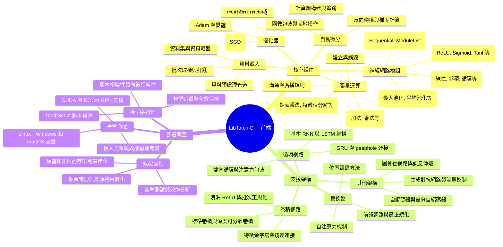

# LibTorch PyTorch C++ 前端開發指南

[[AI_system/libtorch.md]]

## 核心概念
LibTorch 是 PyTorch 的 C++ 前端庫，提供了 PyTorch 核心功能的 C++ API。它使開發者能夠在 C++ 環境中構建、訓練和部署深度學習模型，同時保持與 PyTorch Python API 的相容性。LibTorch 包含張量運算、自動微分、神經網路模組和優化器等核心組件，適合需要高效能、生產環境部署或與現有 C++ 系統整合的應用場景。

## 人工智慧系統領域專章
### 模型拓撲架構
LibTorch 支援的模型拓撲包括：
- 變換器架構：基於自注意力機制的序列建模模型
- 卷積神經網路：用於圖像處理的特徵提取和空間階層學習
- 循環神經網路：處理時間序列資料的遞歸結構
- 圖神經網路：基於圖結構的關係資料建模技術
- 混合架構：結合不同網絡類型以處理複雜多模態任務

### 資料前處理與張量維度
LibTorch 中的資料處理知識包括：
- 張量建立：從原始數據、NumPy陣列或其他來源建立張量
- 資料類型：支援多種數據類型 (float32, float64, int32, int64, bool等)
- 設備管理：CPU 和 CUDA GPU 之間的張量傳輸和內存管理
- 內存佈局：控制張量在記憶體中的排列方式 (チャンネル優先 vs 空間優先)
- 自動微分：建立計算圖以追蹤操作並計算梯度
- 就地操作：儘量使用就地操作以減少內存分配（需要小心使用以避免破壞梯度計算）

### 前向傳播推理
LibTorch 推理過程中的關鍵技術包括：
- 模型定義：繼承 torch::nn::Module 並實作前向傳播方法
- 參數管理：使用 torch::nn::Parameter 管理可學習參數
- 前向傳播：定義輸入如何通過網絡層轉換為輸出
- 評估模式：切換 model->eval() 以關閉 dropout 和批次正規化的訓練行為
- 無梯度上下文：使用 torch::NoGradGuard 防止不必要的梯度計算
- 批次處理：處理不同大小批次時的動態調整或固定批次策略

### 吞吐量與硬體開銷最佳化
提高 LibTorch 系統效率的策略包括：
- 設備選擇：根據模型大小和複雜度選擇 CPU 或 GPU
- 批次大小優化：根據顯存容量和收斂速度平衡訓練效率
- 記憶體池重用：減少內存分配和釋放頻率提升效率
- 演算法選擇：選擇適當的優化器和學習率調度策略
- 模型序列化：使用 torch::jit 腳本或追蹤進行模型優化和部署
- 平行計算：利用多核心 CPU 或多 GPU 進行平行處理

## Mermaid 心智圖


## C++ 實作範例
以下示範一個簡單的線性回歸模型實作，使用 LibTorch C++ API：

```cpp
#include <torch/torch.h>
#include <iostream>

// 簡單的線性回歸模型類
class LinearRegressionModel : public torch::nn::Module {
public:
    LinearRegressionModel(size_t input_size, size_t output_size)
        : linear(torch::nn::LinearOptions(input_size, output_size)) {
        register_module("linear", linear);
    }
    
    torch::Tensor forward(torch::Tensor x) {
        return linear->forward(x);
    }
    
private:
    torch::nn::Linear linear;
};

int main() {
    // 設定隨機種子以確保結果可重現
    torch::manual_seed(42);
    
    // 檢查 CUDA 是否可用
    bool cuda_available = torch::cuda::is_available();
    torch::Device device(cuda_available ? torch::kCUDA : torch::kCPU);
    std::cout << "Using device: " << device.toString() << std::endl;
    
    // 建立模型實例
    size_t input_size = 1;   // 特徵數量
    size_t output_size = 1;  // 輸出數量
    LinearRegressionModel model(input_size, output_size);
    model.to(device);  // 將模型移動到指定設備
    
    // 準備訓練資料
    // y = 2x + 1 + noise
    size_t num_samples = 100;
    torch::Tensor X = torch::randn({num_samples, input_size}, torch::TensorOptions().device(device));
    torch::Tensor true_weights = torch::full({input_size, output_size}, 2.0, torch::TensorOptions().device(device));
    torch::Tensor true_bias = torch::full({output_size}, 1.0, torch::TensorOptions().device(device));
    torch::Tensor y = torch::add(torch::mv(X, true_weights), true_bias);
    y += torch::randn_like(y, torch::TensorOptions().device(device)) * 0.1;  // 加入噪聲
    
    // 定義損失函數和優化器
    torch::nn::MSELoss criterion;
    torch::optim::SGD optimizer(model.parameters(), /*lr=*/0.01);
    
    // 訓練循環
    size_t num_epochs = 1000;
    for (size_t epoch = 0; epoch < num_epochs; ++epoch) {
        // 前向傳播
        torch::Tensor outputs = model.forward(X);
        torch::Tensor loss = criterion(outputs, y);
        
        // 反向傳播和優化
        optimizer.zero_grad();
        loss.backward();
        optimizer.step();
        
        // 每 100 次印出一次進度
        if ((epoch + 1) % 100 == 0) {
            std::cout << "Epoch [" << epoch + 1 << "/" << num_epochs << "], Loss: " 
                      << loss.item<float>() << std::endl;
        }
    }
    
    // 測試模型
    model.eval();  // 切換到評估模式
    torch::NoGradGuard no_grad;  // 防止梯度計算
    
    torch::Tensor test_input = torch::tensor({{2.5}}, torch::TensorOptions().device(device));
    torch::Tensor predicted_output = model.forward(test_input);
    
    std::cout << "\nPrediction after training:" << std::endl;
    std::cout << "Input: " << test_input.item<float>() << std::endl;
    std::cout << "Predicted output: " << predicted_output.item<float>() << std::endl;
    std::cout << "Expected output: approximately " << (2.0 * 2.5 + 1.0) << std::endl;
    
    // 保存模型
    torch::save(model, "linear_regression_model.pt");
    
    // 載入模型（示範）
    LinearRegressionModel loaded_model(input_size, output_size);
    torch::load(loaded_model, "linear_regression_model.pt");
    loaded_model.to(device);
    loaded_model.eval();
    
    torch::NoGradGuard no_grad2;
    torch::Tensor loaded_output = loaded_model.forward(test_input);
    std::cout << "Loaded model prediction: " << loaded_output.item<float>() << std::endl;
    
    return 0;
}
```

## Python 純標準庫範例
以下示範使用純 Python 實作簡單的張量運算概念，僅使用標準庫而非 NumPy 或 PyTorch（這僅用於教育目的，實際應用應該使用 LibTorch 或 PyTorch）：

```python
from typing import List, Tuple
import math
import random

class SimpleTensor:
    """簡單的張量類別，用於示範基本概念"""
    def __init__(self, data: List[float], shape: List[int]):
        """
        初始化張量
        
        參數:
            data: 應為一維列表的張量數據
            shape: 張量的形狀，例如 [2, 3, 4] 表示 2x3x4 的張量
        """
        self.shape = shape[:]
        self.total_size = 1
        for dim in shape:
            self.total_size *= dim
        
        if len(data) != self.total_size:
            raise ValueError(f"資料大小 {len(data)} 與形狀 {shape} 不匹配，期望大小 {self.total_size}")
        
        self.data = data[:]
    
    @staticmethod
    def zeros(shape: List[int]) -> 'SimpleTensor':
        """建立全零張量"""
        size = 1
        for dim in shape:
            size *= dim
        return SimpleTensor([0.0] * size, shape)
    
    @staticmethod
    def ones(shape: List[int]) -> 'SimpleTensor':
        """建立全一張量"""
        size = 1
        for dim in shape:
            size *= dim
        return SimpleTensor([1.0] * size, shape)
    
    @staticmethod
    def randn(shape: List[int]) -> 'SimpleTensor':
        """建立標準正態分佈隨機張量"""
        size = 1
        for dim in shape:
            size *= dim
        return SimpleTensor([random.gauss(0, 1) for _ in range(size)], shape)
    
    def reshape(self, new_shape: List[int]) -> 'SimpleTensor':
        """重塑張量形狀"""
        new_size = 1
        for dim in new_shape:
            new_size *= dim
        if new_size != self.total_size:
            raise ValueError(f"無法重塑形狀 {self.shape} 為 {new_shape}: 大小不匹配")
        return SimpleTensor(self.data, new_shape)
    
    def __add__(self, other: 'SimpleTensor') -> 'SimpleTensor':
        """張量加法"""
        if self.shape != other.shape:
            raise ValueError(f"張量形狀不匹配: {self.shape} vs {other.shape}")
        result_data = [a + b for a, b in zip(self.data, other.data)]
        return SimpleTensor(result_data, self.shape)
    
    def __matmul__(self, other: 'SimpleTensor') -> 'SimpleTensor':
        """矩陣乘法（簡化版本，僅支援 2D）"""
        if len(self.shape) != 2 or len(other.shape) != 2:
            raise ValueError("此實作僅支援 2D 矩陣乘法")
        
        # self: [M, K], other: [K, N] => result: [M, N]
        M, K = self.shape
        K_other, N = other.shape
        
        if K != K_other:
            raise ValueError(f"內部維度不匹配: {K} vs {K_other}")
        
        result_data = []
        for i in range(M):
            for j in range(N):
                sum_val = 0.0
                for k in range(K):
                    sum_val += self.data[i * K + k] * other.data[k * N + j]
                result_data.append(sum_val)
        
        return SimpleTensor(result_data, [M, N])
    
    def __str__(self) -> str:
        """字串表示"""
        if len(self.shape) == 0:
            return str(self.data[0]) if self.data else "[]"
        elif len(self.shape) == 1:
            return str(self.data)
        elif len(self.shape) == 2:
            rows = []
            for i in range(self.shape[0]):
                row = []
                for j in range(self.shape[1]):
                    row.append(f"{self.data[i * self.shape[1] + j]:.4f}")
                rows.append("[" + ", ".join(row) + "]")
            return "[\n " + ",\n ".join(rows) + "\n]"
        else:
            return f"SimpleTensor(shape={self.shape}, data={self.data[:10]}{'...' if len(self.data) > 10 else ''})"

# 使用範例
if __name__ == "__main__":
    print("簡單張量運算示範")
    print("=" * 50)
    
    # 建立一些張量
    t1 = SimpleTensor.randn([2, 3])
    t2 = SimpleTensor.randn([2, 3])
    
    print("\n張量 t1:")
    print(t1)
    
    print("\n張量 t2:")
    print(t2)
    
    # 張量加法
    t3 = t1 + t2
    print("\n張量加法 t1 + t2:")
    print(t3)
    
    # 矩陣乘法示範
    m1 = SimpleTensor.randn([2, 3])
    m2 = SimpleTensor.randn([3, 2])
    
    print("\n矩陣 m1 (2x3):")
    print(m1)
    
    print("\n矩陣 m2 (3x2):")
    print(m2)
    
    # 矩陣乘法
    result = m1 @ m2
    print("\n矩陣乘法 m1 @ m2 (結果應為 2x2):")
    print(result)
    
    # 重塑示範
    t4 = SimpleTensor.ones([2, 3, 4])
    print(f"\n原始張量形狀: {t4.shape}")
    
    t5 = t4.reshape([3, 8])
    print(f"重塑後張量形狀: {t5.shape}")
    
    t6 = t5.reshape([2, 3, 4])
    print(f"重新重塑後張量形狀: {t6.shape}")
```

## 參考資料
[[AI_system/libtorch.md]]

1. PyTorch 官方文件：https://pytorch.org/docs/stable/cpp/frontend.html
2. LibTorch 教學：https://pytorch.org/tutorials/advanced/cpp_frontend.html
3. PyTorch GitHub 倉儲：https://github.com/pytorch/pytorch

## 相關筆記
- [[AI_system/pytorch-tutorials]]
- [[AI_system/deep-learning-frameworks]]
- [[AI_system/model-deployment-cpp]]
- [[AI_system/high-performance-computing]]