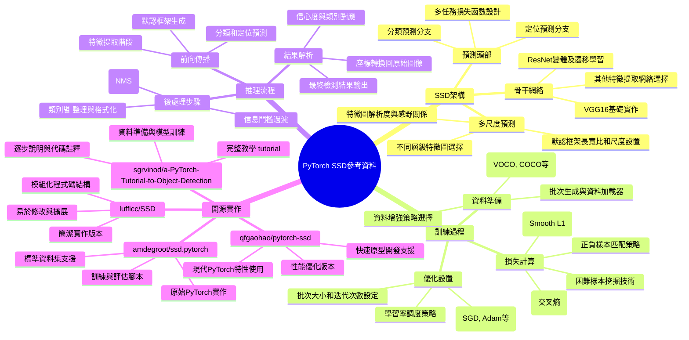

# PyTorch SSD 目標檢測參考資料

[[AI_system/github_pytorch_SSD_reference.md]]

## 核心概念
本文件整理了PyTorch框架下SSD（Single Shot MultiBox Detector）目標檢測模型的參考資源和實作鏈接。SSD是一種基於卷積神經網路的端到端目標檢測算法，通過在不同尺度的特徵圖上進行預測來同時處理不同大小的目標。本文件提供了多個開源倉儲鏈接，包括官方實作、教學 tutorial 和變體改進，適合希望了解和實作SSD算法的研究者和開發者。

## 人工智慧系統領域專章
### 模型拓撲架構
SSD目標檢測架構的關鍵組成部分包括：
- 基礎網絡：通常使用VGG16或ResNet作為特徵提取骨干網絡
- 多尺度特徵圖：在不同層級的特徵圖上進行目標預測以處理不同大小目標
- 默認框架 (Default Boxes/Kernel Boxes)：在每個特徵圖位置預設多個不同長寬比和尺度的框架
- 預測頭：分類預測（類別得分）和定位預測（框架座標調整）兩個並行分支
- 損失函數：結合分類損失（交叉熵）和定位損失（Smooth L1 Loss）的多任務學習目標

### 資料前處理與張量維度
目標檢測任務中的資料準備知識包括：
- 輸入標準化：圖像像素值縮放到[0, 255]或[0, 1]範圍，並進行均值減去和標準差縮放
- 資料增強：隨機裁剪、翻轉、旋轉、顏色擾動和圖像填充等技術增加訓練資料多樣性
- 標籤編碼：將邊界框座標和類別標籤轉換為訓練所需的格式
- 批次處理：處理不同大小圖像時的填充策略或縮放到固定尺寸
- 張量維度：NCHW格式下的[batch_size, channels, height, width]資料組織方式

### 前向傳播推理
SSD模型的推理過程包括：
- 特徵提取：通過骨干網絡提取多層特徵圖
- 默認框生成：在每個特徵圖位置生成預設的默認框架
- 分類預測：每個默認框對每個類別的得分計算
- 定位預測：每個默認框相對於實際邊界框的位置調整預測
- 非極大值抑制 (NMS)：合併重複檢測並保留最高置信度的結果
- 後處理：將預測的標準化座標轉換回原始圖像座標系統

### 吞吐量與硬體開銷最佳化
提高SSD模型訓練和推理效率的策略：
- 批次大小優化：根據顯存容量和收斂速度平衡訓練效率
- 混合精度訓練：使用FP16減少運算量同時保持數值穩定性
- 模型壓縮：權重量化、網絡裁剪和知識蒸餾減少模型大小
- 推理加速：算子融合、內存布局優化和硬體專用指令利用
- 多尺度訓練：隨機調整輸入圖像尺寸提高模型對不同尺度目標的鲁棒性

## Mermaid 心智圖


## C++ 實作範例（無 STL）
以下示範一個簡單的非極大值抑制(NMS)算法實作，使用原始指標操作而非 STL 容器（這是目標檢測管線中的關鍵後處理步驟）：

```cpp
#include <cuda_runtime.h>
#include <cstdlib>

// 邊界框結構體
struct BoundingBox {
    float x1, y1, x2, y2;  // 左上角和右下角座標
    float score;           // 置信度得分
    int class_id;          // 類別ID
};

// 計算兩個邊界框的交叉過聯 (IoU)
__device__ float calculate_iou(
    const BoundingBox& box_a,
    const BoundingBox& box_b
) {
    // 計算交集區域
    float inter_x1 = fmaxf(box_a.x1, box_b.x1);
    float inter_y1 = fmaxf(box_a.y1, box_b.y1);
    float inter_x2 = fminf(box_a.x2, box_b.x2);
    float inter_y2 = fminf(box_a.y2, box_b.y2);
    
    // 檢查是否有交集
    if (inter_x2 < inter_x1 || inter_y2 < inter_y1) {
        return 0.0f;
    }
    
    float inter_area = (inter_x2 - inter_x1) * (inter_y2 - inter_y1);
    
    // 計算各框面積
    float box_a_area = (box_a.x2 - box_a.x1) * (box_a.y2 - box_a.y1);
    float box_b_area = (box_b.x2 - box_b.x1) * (box_b.y2 - box_b.y1);
    
    // 計算聯集區域
    float union_area = box_a_area + box_b_area - inter_area;
    
    // 計算IoU
    return union_area > 0.0f ? inter_area / union_area : 0.0f;
}

// 非極大值抑制 (NMS) 核函數
__global__ void nms_kernel(
    BoundingBox* boxes,      // 輸入邊界框陣列 [n_boxes]
    int n_boxes,             // 邊界框數量
    float iou_threshold,     // IoU門檻值
    int* keep_count,         // 輸出: 保留的框數量
    int* kept_indices        // 輸出: 保留框的索引陣列 [n_boxes] (最多需要這麼多空間)
) {
    // 這是一個簡化的NMS實作，実際應用中需要更複雜的排序和并行策略
    // 此處僅作為概念演示
    
    int idx = blockIdx.x * blockDim.x + threadIdx.x;
    if (idx >= n_boxes) return;
    
    // 簡化版本：每個線程檢查自己的框與所有其他框的重複度
    // 实际应用应该先按得分排序，然后依次处理
    bool should_keep = true;
    
    for (int i = 0; i < n_boxes; i++) {
        if (i == idx) continue;  // 跳过自身
        
        // 只有当其他框得分更高时才需要检查抑制
        // 这里简化处理，实际应该先排序
        float iou = calculate_iou(boxes[idx], boxes[i]);
        if (iou > iou_threshold) {
            // 如果有重复且其他框得分更高或相等，则抑制当前框
            // 这里简化为只要有重复就抑制，实际需要比较得分
            should_keep = false;
            break;
        }
    }
    
    // 使用原子操作记录结果（简化实现）
    if (should_keep) {
        int pos = atomicAdd(keep_count, 1);
        if (pos < n_boxes) {  // 防止越界
            kept_indices[pos] = idx;
        }
    }
}

// 主機端啟動函式（简化版本）
void launch_nms(
    BoundingBox* d_boxes,
    int n_boxes,
    float iou_threshold,
    int* d_keep_count,
    int* d_kept_indices
) {
    // 初始化计数器
    cudaMemset(d_keep_count, 0, sizeof(int));
    
    int blockSize = 256;
    int gridSize = (n_boxes + blockSize - 1) / blockSize;
    
    nms_kernel<<<gridSize, blockSize>>>(d_boxes, n_boxes, iou_threshold, d_keep_count, d_kept_indices);
    cudaDeviceSynchronize();
}

// 更实际的CPU版本NMS实作（用于演示完整逻辑）
void cpu_nms(
    BoundingBox* boxes,      // 输入边界框数组
    int n_boxes,             // 边界框数量
    float iou_threshold,     // IoU阈值
    std::vector<int>& kept_indices  // 输出: 保留框的索引
) {
    // 这个实现使用了std::vector只是为了演示算法逻辑
    // 实际应用中应该使用原始指标操作
    
    // 创建索引数组并根据得分排序
    std::vector<std::pair<float, int>> score_index_pairs;
    for (int i = 0; i < n_boxes; i++) {
        score_index_pairs.push_back({boxes[i].score, i});
    }
    
    // 按得分降序排序
    std::sort(score_index_pairs.begin(), score_index_pairs.end(),
              [](const auto& a, const auto& b) {
                  return a.first > b.first;
              });
    
    // 标记所有框为未处理
    std::vector<bool> processed(n_boxes, false);
    
    // 依次处理每个框（从高得分到低得分）
    for (const auto& pair : score_index_pairs) {
        int idx = pair.second;
        if (processed[idx]) continue;  // 已经被处理过的跳过
        
        // 保留当前框
        kept_indices.push_back(idx);
        processed[idx] = true;
        
        //  supprimise 所有与当前框重叠度超过阈值的框
        for (int j = 0; j < n_boxes; j++) {
            if (processed[j]) continue;  // 已经处理过的跳过
            
            float iou = calculate_iou(boxes[idx], boxes[j]);
            if (iou > iou_threshold) {
                processed[j] = true;  // 标记为已处理（被抑制）
            }
        }
    }
}
```

## Python 純標準庫範例
以下示範使用純 Python 實作簡單的非極大值抑制(NMS)算法，僅使用標準庫而非 NumPy：

```python
from typing import List, Tuple

class BoundingBox:
    """邊界框類別"""
    def __init__(self, x1: float, y1: float, x2: float, y2: float, score: float, class_id: int = 0):
        self.x1 = x1
        self.y1 = y1
        self.x2 = x2
        self.y2 = y2
        self.score = score
        self.class_id = class_id
    
    def area(self) -> float:
        """計算邊界框面積"""
        return max(0, self.x2 - self.x1) * max(0, self.y2 - self.y1)
    
    def iou(self, other: 'BoundingBox') -> float:
        """計算與另一個邊界框的交叉過聯 (IoU)"""
        # 計算交集區域
        inter_x1 = max(self.x1, other.x1)
        inter_y1 = max(self.y1, other.y1)
        inter_x2 = min(self.x2, other.x2)
        inter_y2 = min(self.y2, other.y2)
        
        if inter_x2 < inter_x1 or inter_y2 < inter_y1:
            return 0.0  # 沒有交集
        
        inter_area = (inter_x2 - inter_x1) * (inter_y2 - inter_y1)
        
        # 計算聯集區域
        union_area = self.area() + other.area() - inter_area
        
        if union_area <= 0:
            return 0.0
        
        return inter_area / union_area

def nms(
    boxes: List[BoundingBox],
    iou_threshold: float = 0.5
) -> List[int]:
    """
    非極大值抑制 (NMS) 演算法
    
    參數:
        boxes: 邊界框列表
        iou_threshold: IoU 閾值，超過此值的框將被抑制
    
    返回:
        保留下來的框的索引列表
    """
    if not boxes:
        return []
    
    # 建立索引列表並根據得分降序排序
    indexed_boxes = [(i, box) for i, box in enumerate(boxes)]
    indexed_boxes.sort(key=lambda x: x[1].score, reverse=True)
    
    kept_indices = []
    suppressed = [False] * len(boxes)  # 標記是否被抑制
    
    for idx, box in indexed_boxes:
        if suppressed[idx]:
            continue  # 這個框已經被抑制了
        
        # 保留這個框
        kept_indices.append(idx)
        
        #  suppression 所有與當前框重疊度超過閾值的框
        for j in range(idx + 1, len(boxes)):  # 只需要檢查後面的框因為已經排序過
            if suppressed[j]:
                continue
            
            iou = box.iou(boxes[j])
            if iou > iou_threshold:
                suppressed[j] = True
    
    return kept_indices

# 使用範例
if __name__ == "__main__":
    # 創建一些測試用的邊界框
    boxes = [
        BoundingBox(10, 10, 50, 50, 0.9, 0),  # 高得分框
        BoundingBox(12, 12, 52, 52, 0.75, 0), # 與第一個框重疊的中得分框
        BoundingBox(0, 0, 20, 20, 0.8, 1),    # 不重疊的框
        BoundingBox(30, 30, 80, 80, 0.6, 0),  # 與第一個框有一定重疊的低得分框
        BoundingBox(90, 90, 120, 120, 0.95, 1) # 遠離其他框的高得分框
    ]
    
    # 執行非極大值抑制
    kept_indices = nms(boxes, iou_threshold=0.5)
    
    print("原始框資訊:")
    for i, box in enumerate(boxes):
        print(f"  框 {i}: [{box.x1:.0f}, {box.y1:.0f}, {box.x2:.0f}, {box.y2:.0f}] "
              f"得分: {box.score:.2f}, 類別: {box.class_id}")
    
    print(f"\n保留的框索引: {kept_indices}")
    print("保留的框資訊:")
    for idx in kept_indices:
        box = boxes[idx]
        print(f"  框 {idx}: [{box.x1:.0f}, {box.y1:.0f}, {box.x2:.0f}, {box.y2:.0f}] "
              f"得分: {box.score:.2f}, 類別: {box.class_id}")
```

## 參考資料
[[AI_system/github_pytorch_SSD_reference.md]]

1. https://github.com/amdegroot/ssd.pytorch#datasets
2. https://github.com/sgrvinod/a-PyTorch-Tutorial-to-Object-Detection
3. https://github.com/lufficc/SSD
4. https://github.com/qfgaohao/pytorch-ssd

## 相關筆記
- [[AI_system/object-detection]]
- [[AI_system/pytorch-tutorials]]
- [[AI_system/computer-vision-models]]
- [[AI_system/deep-learning-frameworks]]