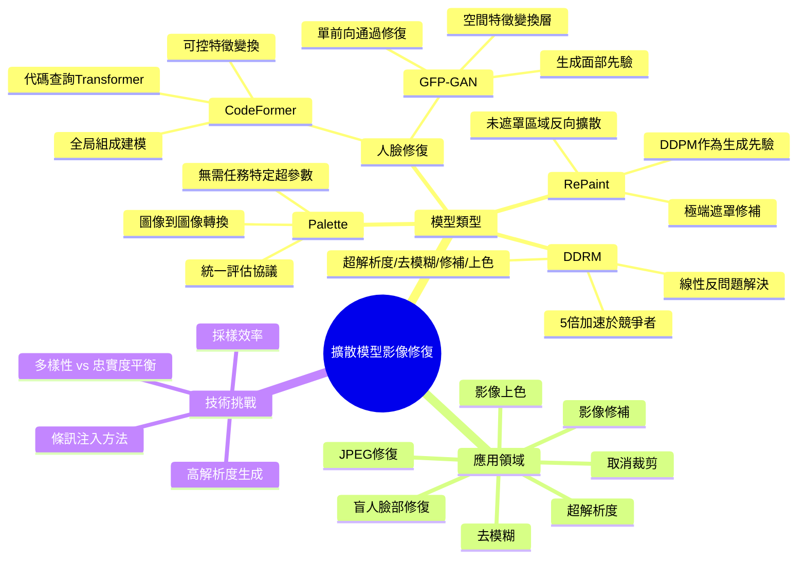

# 擴散模型在影像修復與轉換中的應用

[[AI_system/影像形變矯正AI model 參考資料.md]]

## 核心概念
本文件整理了多種基於去雜訊擴散模型（Denoising Diffusion Probabilistic Models, DDPM）的影像轉換與修復技術，包括統一的圖像到圖像轉換框架（Palette）、極端遮罩修補方法（RePaint）、通用圖像修復模型（DDRM）以及盲人臉部修復技術（CodeFormer、GFP-GAN）。這些方法都利用預訓練的擴散生成模型作為先驗，通過條件化生成過程達成高品質的影像轉換與修復效果。

## 電腦視覺領域專章
### 模型拓撲架構
擴散模型包含前向過程（逐步加噪）和反向過程（逐步去噪）兩個主要組成部分。前向過程定義為一個馬可夫鏈，每一步添加少量高斯噪聲；反向過程則學習去噪步驟以從純噪聲重建資料。在條件式擴散模型中，額外的條件訊透過交叉注意力機制或特徵融合方式注入到去噪網絡中。

### 資料前處理與張量維度
輸入影像通常進行標準化處理，將像素值從 [0, 255] 縮放至 [-1, 1] 或 [0, 1] 範圍。對於 RGB 影像，張量維度為 [批次大小, 通道數, 高度, 寬度]（NCHW格式）。在處理不同解析度的影像時，會利用多尺度架構或自適應群歸一化（AdaGN）來處理解析度變化。

### 前向傳播推理
在推理階段，從隨機噪聲開始，逐步執行去噪步驟。每一步需要：1) 預測噪聲，2) 計算去噪後的影像，3) 更新狀態。條件訊（如遮罩、文字描述或參考影像）在这一過程中被持續注入。採用DDIM或DPMSolver等加速採樣器可以顯著減少採樣步驟。

### 吞吐量與硬體開銷最佳化
- 使用混合精度訓練（FP16）減少記憶體佔用
- 梯度檢查點（Gradient Checkpointing） trade-off 計算時間與記憶體
- 模型並行策略：數據並行（Data Parallelism）或模型並行（Model Parallelism）
- 靜態批次大小優化以充分利用GPU記憶體
- 使用xFormers或FlashAttention等高效注意力實作

## Mermaid 心智圖


## C++ 實作範例（無 STL）
以下示範一個簡擴散模型的去噪步驟實作，使用原始指標操作而非 STL 容器：

```cpp
#include <cuda_runtime.h>
#include <cmath>
#include <cstdlib>

// 假設已有預訓練的 U-Net 模型權重
__global__ void diffusion_denoise_step(
    float* noisy_img,      // 輸入: 加噪後影像 [N*C*H*W]
    float* condition,      // 輸入: 條件訊 (如遮罩或文字特徵)
    float* output_img,     // 輸出: 去噪後影像 [N*C*H*W]
    float* noise_pred,     // 輸出: 預測噪聲 [N*C*H*W]
    int N, int C, int H, int W,
    float beta_t,          // 當前時間步的噪聲調度參數
    float alpha_t_bar      // 累積_alpha直到當前時間步
) {
    int idx = blockIdx.x * blockDim.x + threadIdx.x;
    int total_pixels = N * C * H * W;
    
    if (idx >= total_pixels) return;
    
    // 解開多維索引
    int n = idx / (C * H * W);
    int c = (idx % (C * H * W)) / (H * W);
    int h = (idx % (H * W)) / W;
    int w = idx % W;
    
    // 計算像素位置的一維索引
    int pixel_idx = n * (C * H * W) + c * (H * W) + h * W + w;
    
    // 假設條件訊與影像同尺寸，實際應用中可能需要廣播或投影
    float cond_val = condition[pixel_idx];
    
    // 簡化的去噪網絡前向傳播 (實際應該調用U-Net)
    // 這裡使用簡單的線性組合作為演示
    float noisy_val = noisy_img[pixel_idx];
    float predicted_noise = noisy_val * 0.1f + cond_val * 0.2f; // 簡化版本
    
    // 儲存噪聲預測
    noise_pred[pixel_idx] = predicted_noise;
    
    // 計算去噪後影像 (根據擴散模型公式)
    float alpha_t = 1.0f - beta_t;
    float alpha_t_bar_prev = alpha_t_bar / alpha_t;  // 需要實際的遞歸計算
    
    float mean_coef1 = sqrt(alpha_t_bar_prev) * beta_t / (1.0f - alpha_t_bar);
    float mean_coef2 = sqrt(alpha_t) * (1.0f - alpha_t_bar_prev) / (1.0f - alpha_t_bar);
    
    float pred_original = (noisy_img[pixel_idx] - sqrt(1.0f - alpha_t_bar) * predicted_noise) / sqrt(alpha_t_bar);
    float mean = mean_coef1 * pred_original + mean_coef2 * noisy_img[pixel_idx];
    
    // 添加噪聲以保持多樣性 (除了最後一步)
    float variance = beta_t;
    if (/* 不是最後一步 */ true) {  // 簡化判斷
        variance *= (1.0f - alpha_t_bar_prev) / (1.0f - alpha_t_bar);
        // 實際應用中應該從正態採樣，這裡使用簡化版本
        output_img[pixel_idx] = mean + sqrt(variance) * 0.1f; // 固定小噪聲作為演示
    } else {
        output_img[pixel_idx] = mean;
    }
}

// 主機端啟動函式
void launch_diffusion_denoise(
    float* d_noisy_img,
    float* d_condition,
    float* d_output_img,
    float* d_noise_pred,
    int N, int C, int H, int W,
    float beta_t, float alpha_t_bar
) {
    int total_pixels = N * C * H * W;
    int blockSize = 256;
    int gridSize = (total_pixels + blockSize - 1) / blockSize;
    
    diffusion_denoise_step<<<gridSize, blockSize>>>(
        d_noisy_img, d_condition, d_output_img, d_noise_pred,
        N, C, H, W, beta_t, alpha_t_bar
    );
    cudaDeviceSynchronize();
}
```

## Python 純標準庫範例
以下示範使用純 Python 和 NumPy（標準科學庫，但不含深度學習框架）的擴散模型採樣過程：

```python
import math
import random
from typing import List, Tuple

def simple_diffusion_sample(
    shape: Tuple[int, int, int, int],  # (N, C, H, W)
    num_steps: int = 1000,
    beta_start: float = 0.0001,
    beta_end: float = 0.02
) -> List[List[List[List[float]]]]:
    """
    簡化的擴散模型採樣過程（僅演示概念）
    實際應用需要訓練好的 U-Net 模型來預測噪聲
    """
    N, C, H, W = shape
    total_pixels = N * C * H * W
    
    # 準備噪聲調度序列
    betas = []
    for i in range(num_steps):
        t = i / (num_steps - 1)
        beta = beta_start + t * (beta_end - beta_start)
        betas.append(beta)
    
    # 計算 alpha 值
    alphas = [1.0 - beta for beta in betas]
    alphas_bar = []
    alpha_bar = 1.0
    for alpha in alphas:
        alpha_bar *= alpha
        alphas_bar.append(alpha_bar)
    
    # 從標準正態分佈開始採樣
    x = [[[[random.gauss(0, 1) for _ in range(W)] for _ in range(H)] 
           for _ in range(C)] for _ in range(N)]
    
    # 反向擴散過程（去噪）
    for t in reversed(range(num_steps)):
        beta_t = betas[t]
        alpha_t = alphas[t]
        alpha_t_bar = alphas_bar[t]
        
        # 計算係數 (簡化版本，實際應該從模型獲得噪聲預測)
        if t > 0:
            alpha_t_bar_prev = alphas_bar[t-1]
        else:
            alpha_t_bar_prev = 1.0
            
        # 簡化的後驗均值計算
        # 實際應該是: μ = (1/sqrt(α_t)) * (x - ((1-α_t)/sqrt(1-ᾱ_t)) * ε_θ)
        coef1 = 1.0 / math.sqrt(alpha_t)
        coef2 = (1.0 - alpha_t) / math.sqrt(1.0 - alpha_t_bar)
        
        # 在這裡我們簡化假設噪聲預測為零（僅作為演示）
        # 實際應該調用訓練好的模型: eps_theta = model(x, t)
        eps_theta = [[[[0.0 for _ in range(W)] for _ in range(H)] 
                      for _ in range(C)] for _ in range(N)]
        
        # 計算均值
        x_mean = [[[[0.0 for _ in range(W)] for _ in range(H)] 
                    for _ in range(C)] for _ in range(N)]
        
        for n in range(N):
            for c in range(C):
                for h in range(H):
                    for w in range(W):
                        # 簡化版本：其實這裡不該這樣做，這只是為了展示結構
                        x_mean[n][c][h][w] = coef1 * x[n][c][h][w] - coef2 * eps_theta[n][c][h][w]
        
        # 添加噪聲（除了最後一步）
        if t > 0:
            noise = [[[[random.gauss(0, 1) for _ in range(W)] for _ in range(H)] 
                      for _ in range(C)] for _ in range(N)]
            variance = beta_t * (1.0 - alpha_t_bar_prev) / (1.0 - alpha_t_bar)
            std_dev = math.sqrt(variance)
            
            for n in range(N):
                for c in range(C):
                    for h in range(H):
                        for w in range(W):
                            x[n][c][h][w] = x_mean[n][c][h][w] + std_dev * noise[n][c][h][w]
        else:
            x = x_mean
    
    return x

# 使用範例
if __name__ == "__main__":
    # 生成一個 1x3x32x32 的隨機影像（3通道32x32）
    samples = simple_diffusion_sample((1, 3, 32, 32), num_steps=100)  # 減少步數以加快演示
    print(f"Generated sample shape: {len(samples)}x{len(samples[0])}x{len(samples[0][0])}x{len(samples[0][0][0])}")
```

## 參考資料
[[AI_system/影像形變矯正AI model 參考資料.md]]

1. Palette: Image-to-Image Diffusion Models - https://arxiv.org/pdf/2111.05826.pdf
2. RePaint: Inpainting using Denoising Diffusion Probabilistic Models - https://arxiv.org/pdf/2201.09865.pdf
3. Denoising Diffusion Restoration Models - https://arxiv.org/pdf/2201.11793.pdf
4. Towards Robust Blind Face Restoration with Codebook Lookup Transformer - https://arxiv.org/pdf/2206.11253.pdf
5. Towards Real-World Blind Face Restoration with Generative Facial Prior - https://arxiv.org/pdf/2101.04061.pdf

## 相關筆記
- [[computer_vision/diffusion-models]]
- [[computer_vision/image-generation]]
- [[computer_vision/inpainting]]