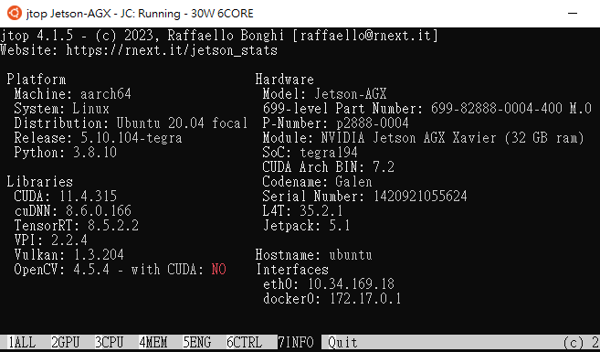
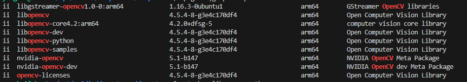

1. [OpenCV turns on cuda acceleration in Nvidia Jetson platform。OpenCV在Nvidia Jetson平台開啟cuda加速](https://hackmd.io/6IloyiWMQ_qbIpIE_c_1GA)

OpenCV turns on cuda acceleration in Nvidia Jetson platform。OpenCV在Nvidia Jetson平台開啟cuda加速

Jetpack系統預設OpenCV未開啟CUDA加速
承接[Jetson AGX Xavier 系統環境設定1_在windows10環境連接與安裝](https://hackmd.io/@YungHuiHsu/HJ2lcU4Rj)

環境安裝好後，接下來進入程式編譯的部分

檢視系統安裝的OpenCV相關套件
jtop
使用 jetson-stats 套件檢視系統狀態 ，在terminal輸入`jtop`
```注意"OpenCV: 4.5.4 with CUDA: ==NO=="，表示Jetpack預設安裝的OpenCV未開啟CUDA加速



dpkg -l |grep -i opencv```


可以看到系統中的OpenCV相關套件，其中libopencv-python 是python使用系統的opencv， 這個套件會跟python-opencv衝突，請避免自行透過pip install opencv-python安裝

libopencv-python 與python-opencv差異如下

libopencv-python
這是一個 Python 的 OpenCV 綁定庫，提供了對 OpenCV 功能的訪問。它是通過 C++ 實現的 OpenCV 庫，並使用 ctypes 或其他技術將其與 Python 交互。因此，libopencv-python 提供了完整的 OpenCV 功能和性能，並與 Python 程序進行交互。您可以使用 pip 包管理器來安裝 libopencv-python。
python-opencv
這也是一個 Python 的 OpenCV 綁定庫，提供了對 OpenCV 功能的訪問。與 libopencv-python 不同，python-opencv 是通過使用 SWIG（Simplified Wrapper and Interface Generator）生成的綁定，將 C++ 的 OpenCV 功能封裝到 Python 中。它提供了與 libopencv-python 類似的功能，但可能有一些細微的差異和限制。您可以使用操作系統的軟件包管理器（如 apt）來安裝 python-opencv。
nvidia-opencv

為 NVIDIA 提供的針對自家 GPU 的優化版本。是基於原始的 OpenCV 庫進行了修改和優化，以充分利用 NVIDIA GPU 的計算能力和硬件加速功能，提高圖像處理和計算的性能，通常以庫文件或可執行文件的形式提供
在 Python 中無法直接導入和使用 nvidia-opencv
進一步檢視apt show libopencv-python
Package: libopencv-python
Version: 4.5.4-8-g3e4c170df4
Priority: optional
Section: libs
Maintainer: admin@opencv.org
Installed-Size: 12.0 MB
Provides: python-opencv
Depends: libopencv (= 4.5.4-8-g3e4c170df4), libc6 (>= 2.17), libgcc-s1 (>= 3.0), libstdc++6 (>= 9)
Conflicts: python-opencv
Replaces: python-opencv
Homepage: http://opencv.org
Download-Size: 3,201 kB
APT-Manual-Installed: yes
APT-Sources: https://repo.download.nvidia.com/jetson/common r35.2/main arm64 Packages
Description: Open Computer Vision Library
 Python bindings for Open Source Computer Vision Library

從源碼建立支援CUDA加速的OpenCV
請參考

[Compiling OpenCV from Source](https://developer.ridgerun.com/wiki/index.php/Compiling_OpenCV_from_Source)
[2023。mdegans/nano_build_opencv](https://github.com/mdegans/nano_build_opencv)
參考資料
Compiling OpenCV from Source
2023。mdegans/nano_build_opencv
    編譯好的./build_opencv.sh可以一鍵建立
    [2019/05mdegans。OpenCV build script](https://developer.ridgerun.com/wiki/index.php/Compiling_OpenCV_from_Source)
[2022/11。穿山甲说了什么。小结 : 解决 NX 中 OpenCV“Compiled CUDA : NO”问题](https://zhuanlan.zhihu.com/p/580968763)
[2021/09。Hakureirm。Jetson Xavier NX OpenCV 安装](https://zhuanlan.zhihu.com/p/411901208)